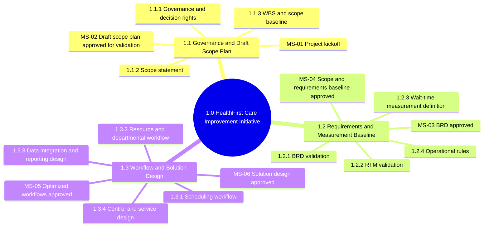
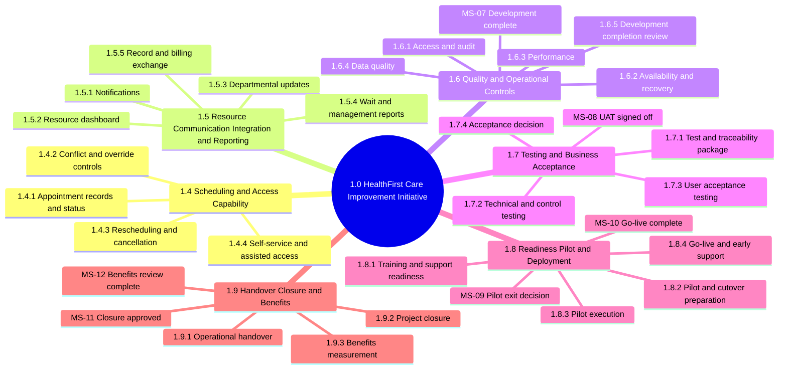

# Project Scope Management Plan with Work Breakdown Structure

| Document field     | Details                                                                     |
| ------------------ | --------------------------------------------------------------------------- |
| File name          | `Capstone_Project_M02L02_Scope_Management.md`                               |
| Project            | HealthFirst Care - Patient Experience and Operational Efficiency Initiative |
| Version            | 0.1                                                                         |
| Document status    | Draft for stakeholder review                                                |
| Primary references | BRD version 0.1; RTM version 0.1; Stakeholder Analysis version 0.1          |
| Template reference | `WBS template.pdf`                                                          |

## 1. Executive summary

This plan defines the proposed scope baseline for the HealthFirst Care Improvement Initiative, decomposes the work into a numbered Work Breakdown Structure (WBS), and explains how scope will be approved, monitored, validated, and changed. The project focuses on the outpatient appointment journey and supporting scheduling, resource visibility, notifications, departmental updates, reporting, approved data exchange, testing, training, pilot, and deployment activities. [SRC-01, SRC-03, SRC-04]

The main intended outcome is a 20% reduction in average eligible patient wait time compared with an approved baseline. Other objectives are improved scheduling access and accuracy, better resource visibility, improved communication, and less administrative rework. The supplied appointment extract does not contain check-in or consultation-start timestamps, so it cannot establish the wait-time baseline. The formula, exclusions, comparison periods, and minimum data completeness must be approved before benefits are measured. [SRC-03, SRC-04]

The scope, BRD, RTM, delivery schedule, budget ceiling, named approvers, and applicable regulatory obligations are not yet approved. They are treated as draft inputs. No build work should be treated as authorized merely because it appears in this WBS. Formal approval and funding are required at the identified gates.

## 2. Project scope statement

### 2.1 Project purpose and boundary

The project will improve the outpatient appointment journey from booking through check-in, consultation-start measurement, appointment-related communication, and approved referral, result, and handoff status updates. It includes changes to people, processes, information, and supporting technology. It does not select a specific Hospital Information System, cloud product, or vendor and does not authorize full replacement of hospital systems.

The scope baseline becomes controlled only after the sponsor and named process owners approve the scope statement, WBS, BRD, RTM, acceptance approach, release boundary, and decision rights.

### 2.2 Project objectives

| Objective ID | Objective | Success or validation measure |
| --- | --- | --- |
| OBJ-01 | Reduce patient waiting | Average eligible patient wait time is reduced by at least 20% against an approved baseline and comparable post-implementation period. |
| OBJ-02 | Improve scheduling access, accuracy, and reliability | Agreed online and staff-assisted channels work; unauthorized overlaps are prevented; appointment status/history is available; and an outage process is tested. |
| OBJ-03 | Improve resource allocation and visibility | Current appointment-related doctor, room, and equipment status is available during scheduling and invalid overlapping assignments are prevented. |
| OBJ-04 | Improve communication | Approved appointment messages and appointment-related departmental updates are generated, recorded, and available to authorized users. |
| OBJ-05 | Reduce administrative rework | Appointment information is more consistent across included scheduling, record, billing, exception, and reporting processes. |

### 2.3 In-scope deliverables and activities

| In-scope item | Included work and deliverable | Main traceability |
| --- | --- | --- |
| Requirements and workflow validation | Validate the BRD and RTM with representative patients, clinicians, administrators, IT, leadership, privacy/records, and affected departments; document current and future workflows, business rules, exceptions, data definitions, and decisions. | BR-01 to BR-05; FR-01 to FR-11; NFR-01 to NFR-05 |
| Appointment scheduling | Configure or develop outpatient appointment creation, rescheduling, cancellation, slot release, required fields, standard statuses, reasons, and status history. | FR-01, FR-03, FR-06 |
| Conflict prevention | Define duration, buffer, resource, and override rules; check the full appointment period; block unauthorized overlaps for patients, doctors, rooms, and equipment; record authorized overrides. | FR-02; AC-02 |
| Access channels and usability | Support online self-service plus phone and in-person staff-assisted scheduling with clear labels and instructions. | FR-04; NFR-01; AC-05 |
| Wait-time capture and reporting | Capture scheduled, check-in, and consultation-start times; validate missing data; calculate and report the approved wait measure. | FR-07, FR-11; NFR-05; AC-01, AC-06 |
| Resource tracking dashboard | Display current doctor, room, and equipment status and prevent assignment of resources that are unavailable, under maintenance, in use, reserved, or already committed for an overlapping period. The required refresh timing is TBD. | FR-08, FR-11; AC-04 |
| Appointment notifications | Record communication preference and consent; generate approved confirmation, reminder, change, cancellation, material-delay, and next-step email/SMS messages; retain delivery status. Any use of the term real-time requires an agreed event-to-message target. | FR-05; AC-03 |
| Departmental status updates | Capture and display appointment-related referral, test-result, and handoff status, responsible department, and timestamp for participating departments. | FR-09; AC-08 |
| Operational reports and data quality | Provide basic reports for wait time, status, conflicts, resources, notification outcomes, and missing or failed data; provide visible correction handling. | FR-11; NFR-05; AC-06 |
| Approved record/billing exchange | Exchange essential appointment identifiers and status changes with specifically approved record and billing processes and display failed updates for correction. This Should Have item may be phased. | FR-10; AC-09 |
| Operational and technical controls | Implement or configure role-based access, audit, data validation, agreed operating-hours availability, tested outage fallback and recovery, and an agreed performance target after demand is measured. | NFR-02 to NFR-05; AC-07 |
| Delivery readiness and transition | Complete design review, build/configuration, testing, UAT, training, support preparation, pilot, cutover/rollback planning, deployment, early support, handover, and benefits review. | AC-01 to AC-09; approved transition requirements |

### 2.4 Out-of-scope activities

| Out-of-scope item | Boundary explanation |
| --- | --- |
| Clinical diagnosis or treatment decisions | The project supports appointment administration and communication, not clinical decision-making. |
| Full replacement of every hospital system | Only approved appointment-related capabilities and interfaces are included. |
| Emergency and inpatient workflow redesign | The current project boundary is the outpatient appointment journey. |
| Hospital-wide workforce, bed, or supply planning | Resource visibility is limited to appointment-related doctors, rooms, and equipment. |
| Recruitment or hiring additional clinical staff | Staffing changes require a separate workforce decision and business case. |
| Hospital construction or major equipment purchasing | Capital works and purchases require separate approval and funding. |
| Full operating-room scheduling redesign | Operating-room scheduling has separate clinical and operational rules. |
| Prescription-management redesign or clinical follow-up routing | This is a future need outside the current phase. |
| Billing-policy redesign | Only approved appointment-data exchange and exception handling are considered. |
| External integrations not specifically approved | Each additional interface requires impact assessment and formal scope approval. |
| Advanced analytics beyond approved operational reports | Advanced forecasting or optimization is excluded unless added through change control. |

### 2.5 Constraints

| Constraint ID | Constraint | Scope implication |
| --- | --- | --- |
| C-01 | Budget for system upgrades is limited; the approved ceiling and change threshold are TBD. | Must Have requirements are prioritized. FR-10 integration and other Should Have work may be phased. |
| C-02 | The approved implementation dates, phase durations, and schedule tolerance are TBD. | The WBS uses preliminary ranges, not committed dates. The six-week capstone sequence is a learning schedule, not evidence of an operational deployment duration. |
| C-03 | Legacy scheduling and record systems may restrict integration, reliability, security, and data availability. | A technical assessment is required before design approval and estimation. |
| C-04 | Network downtime may interrupt online booking and notifications. | A manual fallback, recovery, and reconciliation process must be tested before release. |
| C-05 | Clinical and operational subject-matter expert availability is limited. | Reviews must be scheduled, focused, and supported by named representatives and backups. |
| C-06 | The supplied sample data is small and incomplete. | It cannot establish reliable wait, overlap, peak-demand, shortage, or utilization baselines. |
| C-07 | Applicable privacy, security, accessibility, consent, retention, and record-handling obligations are not confirmed. | Authorized representatives must confirm the governing obligations. HIPAA must not be claimed as applicable or satisfied unless applicability is confirmed and the required compliance evidence is accepted by an authorized representative. |
| C-08 | No target technology, vendor, HIS, or cloud solution has been approved. | Technology options remain subject to cost, security, integration, procurement, and feasibility review. |
| C-09 | Performance, availability, notification timing, and data-quality thresholds are TBD. | These measures must be agreed before design and acceptance testing are finalized. |
| C-10 | Implementation must minimize disruption to patient care. | Pilot, cutover, rollback, support coverage, and go-live timing require operational approval. |

### 2.6 Assumptions

| Assumption ID | Assumption | Validation or response if false |
| --- | --- | --- |
| A-01 | Hospital leadership will name a sponsor, approvers, process owners, and workstream owners. | Confirm at kickoff; unresolved authority blocks scope-baseline approval. |
| A-02 | Representative patients, clinicians, administrative staff, IT, and support roles will be available for reviews, UAT, training, and pilot activities. | Confirm availability and backups in the stakeholder plan; assess schedule impact if unavailable. |
| A-03 | Included systems can provide or exchange essential appointment information. | Validate through technical and data assessment; phase or change scope if not feasible. |
| A-04 | Doctors and resource owners will maintain availability and status under an agreed ownership process. | Define update responsibilities and monitor data quality during pilot. |
| A-05 | Patients will provide valid contact information and communication consent where required. | Provide visible exception handling and non-digital alternatives. |
| A-06 | Representative baseline and post-implementation data can be collected with agreed completeness. | If not, revise the measurement approach through change control and do not claim the 20% benefit. |
| A-07 | Approved environments, test data, access, and support resources will be available. | Confirm in readiness reviews; revise schedule or scope if missing. |
| A-08 | Reviews and decisions will occur within response times agreed when the schedule is baselined. | Escalate overdue decisions and record the schedule effect. |
| A-09 | Source owners will validate data definitions and accuracy rather than assuming the supplied extracts represent production quality. | Log data issues and update requirements, controls, or estimates as needed. |

An invalid assumption does not authorize silent scope expansion. Its impact must be assessed through the change process in Section 8.

### 2.7 Dependencies

| Dependency ID | Dependency |
| --- | --- |
| D-01 | Named sponsor, governance, funding ceiling, release scope, and delivery schedule. |
| D-02 | Agreement on appointment types, duration, buffers, resource rules, override authority, statuses, and message timing. |
| D-03 | Technical, integration, security, network, and procurement feasibility assessment. |
| D-04 | Approved access to included systems, interfaces, environments, and representative test data. |
| D-05 | Confirmed owners and definitions for patient identity, contact, consent, appointments, resources, timestamps, notifications, and reports. |
| D-06 | Approved wait-time formula, eligible population, exclusions, baseline/comparison periods, and minimum data completeness. |
| D-07 | Confirmation of applicable organizational and legal controls by privacy, security, and records authorities. |
| D-08 | Representative business, clinical, patient, testing, training, support, and pilot participation. |

### 2.8 Acceptance boundaries

- **Scope acceptance:** The sponsor and named process owners approve this scope statement, WBS, exclusions, priorities, owners, and release boundary. Current RTM requirements remain Pending until the appropriate decision is recorded.
- **Release acceptance:** Approved Must Have requirements pass traceable functional, access, data-quality, fallback, reporting, and representative UAT scenarios. Any approved release-one FR-10 integration must also pass AC-09.
- **Conditional scope:** FR-10 and NFR-04 are Should Have items. They enter the first-release baseline only after explicit feasibility, budget, and priority approval.
- **Benefits acceptance:** The 20% wait reduction is a post-implementation outcome. Before release, the project verifies the timestamp capture, formula, reporting, and baseline readiness; the benefit is assessed only after a comparable operating period.
- **Evidence boundary:** Acceptance uses approved test records and representative operational data, not the small supplied CSV extracts as proof of hospital-wide performance.
- **Compliance boundary:** Release evidence must satisfy controls confirmed by authorized HealthFirst Care representatives; this document does not certify HIPAA or another named regime.
- **Operational readiness:** Training, support ownership, pilot results, outage recovery, rollback, unresolved critical defects, and the release decision must be documented before deployment.
- **Change boundary:** New sites, departments, integrations, advanced analytics, staffing, construction, or excluded clinical workflows require an approved change request.

## 3. WBS approach and planning rules

The WBS is deliverable-oriented and uses three levels:

- **Level 1:** `1.0` - the full HealthFirst Care Improvement Initiative;
- **Level 2:** `1.1` to `1.9` - major deliverable groups or phases; and
- **Level 3:** `1.x.x` - manageable work packages with an owner, output, and preliminary duration.

The detailed table in Section 5 keeps the six columns from `WBS template.pdf`: WBS ID, Task Name, Task Description, Owner, Milestone/Deliverable, and Estimated Duration. [SRC-06]

The following rules apply:

1. Lower-level work must fully cover its parent deliverable without adding unrelated scope.
2. Each work package must produce reviewable evidence and link to an approved requirement, change request, transition need, or project-control need.
3. Owners in the WBS are roles; named individuals and deputies remain to be assigned.
4. Duration ranges are preliminary effort windows. They are not calendar commitments and may overlap where dependencies allow.
5. No calendar schedule or budget baseline should be approved until technical feasibility, resource capacity, procurement needs, and stakeholder availability are assessed.
6. Milestones are completion or decision points and do not have duration beyond the review activity shown in the table.

## 4. Hierarchical WBS diagrams

### 4.1 Plan, requirements, and design

### 4.2 Build, test, deploy, and measure

## 5. Detailed Work Breakdown Structure

| WBS ID | Task Name | Task Description | Owner | Milestone/Deliverable | Estimated Duration |
| --- | --- | --- | --- | --- | --- |
| 1.0 | HealthFirst Care Improvement Initiative | Deliver approved outpatient scheduling, resource visibility, communication, reporting, and operational-readiness improvements | Project Manager (TBD) | Project delivered and transferred to operations | Preliminary 20-26 weeks to deployment; benefits review later |
| 1.1 | Governance and Draft Scope Plan | Establish project authority and prepare the scope plan and WBS for validation | Project Manager | Governance confirmed and draft scope plan ready for validation | 1 week initial; governance continues |
| 1.1.1 | Governance and Decision Rights | Confirm sponsor, process owners, workstream leads, approvers, escalation route, and change authority | Project Manager | Governance and responsibility record; **MS-01 - Project kickoff** | 2 days |
| 1.1.2 | Scope Statement | Finalize objectives, inclusions, exclusions, assumptions, constraints, dependencies, and acceptance approach | Business Analyst | Reviewed project scope statement | 2 days |
| 1.1.3 | WBS and Scope Plan | Finalize the WBS, completion evidence, milestone list, and draft scope plan for stakeholder validation | Business Analyst / Project Manager | **MS-02 - Draft scope plan and WBS approved for validation** | 1 day |
| 1.2 | Requirements and Measurement Baseline | Validate requirements, priorities, traceability, business rules, and measurement needs | Business Analyst | Approved requirements and measurement baseline | 2 weeks |
| 1.2.1 | BRD Validation | Review the draft BRD with patient, clinical, administrative, IT, control, and leadership representatives | Business Analyst | **MS-03 - BRD completed and approved** | 3 days |
| 1.2.2 | RTM Validation | Confirm requirement, objective, stakeholder, priority, deliverable, and acceptance links | Business Analyst | Approved RTM with FR-01 to FR-11 and NFR-01 to NFR-05 baselined | 2 days |
| 1.2.3 | Wait-Time Measurement Definition | Agree formula, eligible appointments, exclusions, periods, fields, owners, and data-quality threshold | Business Analyst / Data Analyst | Approved wait-time measurement specification | 3 days |
| 1.2.4 | Operational Rules and Baseline Approval | Agree duration, buffers, resource status, overrides, notification rules, availability targets, and exception handling; obtain formal baseline approval | Business Analyst / Process Owners | **MS-04 - Scope and requirements baseline approved** | 4 days |
| 1.3 | Optimized Workflow and Solution Design | Define approved future-state processes and supporting solution design | Business Analyst / IT Manager | Signed future-state workflows and solution design | 3 weeks |
| 1.3.1 | Scheduling Workflow Package | Define booking, changes, assisted channels, status history, conflicts, and exceptions | Administrative Operations Lead | Approved scheduling process maps and rules | 4 days |
| 1.3.2 | Resource and Departmental Workflow Package | Define resource ownership, availability updates, referrals, results, handoffs, and escalation | Clinical Operations Lead | **MS-05 - Optimized workflows signed off** | 4 days |
| 1.3.3 | Data, Integration, and Reporting Design | Define required data, approved exchange, exception handling, wait measures, and dashboard content | IT Manager / Data Analyst | Data mapping, interface outline, and report specification | 5 days |
| 1.3.4 | Control and Service Design | Define access roles, audit, privacy/security controls, fallback, recovery, availability, and performance targets | IT Manager / Privacy-Security Representative | **MS-06 - Solution and control design approved** | 2 days |
| 1.4 | Appointment Scheduling and Access Capability | Configure or develop the main appointment functions | IT Delivery Lead | Test-ready scheduling and access capability | 5 weeks |
| 1.4.1 | Appointment Record and Status Capability | Implement required fields, creation, standard statuses, history, and validation | IT Delivery Team | FR-01 and FR-06 capability ready for testing | 1 week |
| 1.4.2 | Conflict and Override Capability | Implement full-period patient, doctor, room, and equipment conflict checks with controlled overrides | IT Delivery Team | FR-02 capability ready for testing | 1-2 weeks |
| 1.4.3 | Rescheduling and Cancellation Capability | Implement slot release, change reason, date, and appointment history | IT Delivery Team | FR-03 capability ready for testing | 1 week |
| 1.4.4 | Self-Service and Assisted Access | Implement online appointment management while retaining phone and in-person support | IT Delivery Team / Administrative Lead | FR-04 and NFR-01 capability ready for testing | 1-2 weeks |
| 1.5 | Resource, Communication, Integration, and Reporting Capability | Develop the remaining operational and information capabilities | IT Delivery Lead | Test-ready resource, communication, integration, and reporting package | 5 weeks, partly parallel |
| 1.5.1 | Notification Capability | Record preference and consent and generate approved appointment messages and delivery status | IT Delivery Team | FR-05 notification capability and delivery log | 1 week |
| 1.5.2 | Resource Availability Capability | Display doctor, room, and equipment status and prevent invalid or overlapping allocation | IT Delivery Team / Resource Owners | FR-08 resource dashboard and allocation controls | 1-2 weeks |
| 1.5.3 | Departmental Update Capability | Provide referral, result, and handoff statuses with responsible department and timestamps | IT Delivery Team / Departmental Leads | FR-09 departmental update capability | 1 week |
| 1.5.4 | Wait-Time and Management Reporting | Capture wait timestamps and report waits, status, conflicts, resources, notifications, and missing data | IT Delivery Team / Data Analyst | FR-07 and FR-11 dashboards and reports | 1-2 weeks |
| 1.5.5 | Record and Billing Exchange | Implement approved appointment-data exchange and visible failed-update handling | IT Integration Team | FR-10 interface and correction list; conditional Should Have scope | 1-2 weeks |
| 1.6 | Quality and Operational Controls | Implement and verify cross-cutting non-functional controls | IT Manager | Control-readiness evidence | 3 weeks, partly parallel |
| 1.6.1 | Access and Audit Controls | Configure authenticated role-based access and audit important changes | IT Security Team | NFR-02 control evidence | 4 days |
| 1.6.2 | Availability and Recovery Controls | Prepare operating-hours monitoring, manual fallback, recovery, and reconciliation procedures | IT Operations Lead | NFR-03 fallback and recovery procedure | 4 days |
| 1.6.3 | Performance Controls | Agree and test response-time targets after current demand is measured | IT Performance Lead | NFR-04 target and results; conditional Should Have scope | 3 days |
| 1.6.4 | Data-Quality Controls | Validate required dates, identifiers, status, and resources and show items requiring correction | Data Analyst / IT Team | NFR-05 validation and correction evidence | 4 days |
| 1.6.5 | Development Completion Review | Confirm that scheduling, resource dashboard, notifications, departmental updates, reporting, approved integration, and control packages are test-ready | IT Delivery Lead / Test Lead | **MS-07 - Development complete** | 1 day |
| 1.7 | Testing and Business Acceptance | Verify requirements and obtain business acceptance | Test Lead / Business Analyst | Accepted solution and release recommendation | 3 weeks |
| 1.7.1 | Test and Traceability Package | Derive test conditions from approved requirements and AC-01 to AC-09 and update the RTM | Test Lead / Business Analyst | Approved test plan, cases, test data, and RTM links | 3 days |
| 1.7.2 | Technical and Control Testing | Complete functional, integration, security, performance, data, fallback, and recovery testing | Test Lead / IT Team | Test results and defect log | 5 days |
| 1.7.3 | User Acceptance Testing | Run representative patient, administrative, clinical, and management scenarios and retest corrected defects | Business Process Owners / Test Lead | UAT results and resolved blocking defects | 5 days |
| 1.7.4 | Acceptance Decision | Review evidence, residual risks, deferred items, and release recommendation | Project Sponsor / Business Process Owners | **MS-08 - UAT signed off** | 2 days |
| 1.8 | Readiness, Pilot, and Deployment | Prepare users and operations, conduct the pilot, and deploy the approved release | Project Manager / Change Lead | Operational service and support handover | 3 weeks plus early support |
| 1.8.1 | Training and Support Readiness | Prepare procedures, training, FAQs, support route, outage instructions, and known issues | Change and Training Lead | Approved training and support package | 1 week |
| 1.8.2 | Pilot and Cutover Preparation | Confirm pilot scope, data, users, entry criteria, cutover steps, rollback, and support coverage | Project Manager / IT Operations | Approved pilot and cutover plan | 3 days |
| 1.8.3 | Pilot Execution | Run the pilot, monitor issues and data quality, gather feedback, and resolve blocking issues | Project Manager / Process Owners | Pilot report; **MS-09 - Pilot exit decision** | 1 week |
| 1.8.4 | Go-Live and Early Support | Deploy the approved release, monitor operations, and manage early-life issues | IT Operations / Project Manager | **MS-10 - Go-live completed** | 2 days plus 2 weeks early support |
| 1.9 | Handover, Closure, and Benefits Review | Transfer ownership, close delivery scope, and measure outcomes | Project Manager / Hospital Leadership | Closure report and benefits assessment | 1 week plus later review |
| 1.9.1 | Operational Handover | Transfer procedures, monitoring, support ownership, open issues, and service responsibilities | IT Operations / Business Process Owners | Signed operational handover | 2 days |
| 1.9.2 | Scope and Project Closure | Reconcile accepted deliverables, approved changes, deferred items, lessons, and records | Project Manager / Business Analyst | **MS-11 - Project closure approved** | 2 days |
| 1.9.3 | Benefits Measurement | Compare the approved post-implementation period with the baseline and review adoption, rework, resource visibility, and communication | Hospital Leadership / Data Analyst | **MS-12 - Benefits review completed** | 2-3 days after the approved comparison period; duration TBD |

## 6. Milestone register

All milestones are shown as Planned because the current BRD, RTM, scope, owners, and approvals are still draft or TBD.

| Milestone ID | Milestone | Related WBS | Minimum completion evidence | Decision owner | Initial status |
| --- | --- | --- | --- | --- | --- |
| MS-01 | Formal project kickoff completed | 1.1.1 | Named governance roles, decision rights, meeting record, and action log | Project Sponsor / Project Manager | Planned |
| MS-02 | Draft scope plan and WBS approved for validation | 1.1.3 | Quality-checked draft scope statement and WBS authorized to enter stakeholder validation | Project Manager | Planned |
| MS-03 | BRD completed and approved | 1.2.1 | Stakeholder review comments resolved and authorized approval recorded | Project Sponsor / Process Owners | Planned |
| MS-04 | Scope and requirements baseline approved | 1.2.4 | Approved scope statement, WBS, BRD, RTM, wait specification, operational rules, priorities, and decision record | Project Sponsor / Process Owners | Planned |
| MS-05 | Optimized workflows signed off | 1.3.2 | Approved current/future workflow maps, roles, exceptions, and handoff decisions | Clinical and Administrative Process Owners | Planned |
| MS-06 | Solution and control design approved | 1.3.4 | Approved design, data mapping, reports, interfaces, controls, and feasibility assessment | IT Manager / Authorized Control Approver / Sponsor | Planned |
| MS-07 | Development completed | 1.4-1.6; gate at 1.6.5 | Test-ready scheduling, resource dashboard, notification, departmental update, reporting, approved integration, and control packages with build evidence | IT Delivery Lead / Test Lead | Planned |
| MS-08 | UAT signed off | 1.7.4 | Traceable test results, defect disposition, residual-risk record, and acceptance decision | Business Process Owners / Sponsor | Planned |
| MS-09 | Pilot exit decision approved | 1.8.3 | Pilot results, data-quality review, readiness status, issue disposition, and go/no-go recommendation | Project Sponsor / Project Manager | Planned |
| MS-10 | Go-live completed | 1.8.4 | Approved release deployed, support active, monitoring active, and rollback decision window closed | Project Sponsor / IT Operations | Planned |
| MS-11 | Project closure approved | 1.9.2 | Accepted-deliverables register, operational handover, deferred-items list, lessons, and closure decision | Project Sponsor | Planned |
| MS-12 | Benefits review completed | 1.9.3 | Approved comparison analysis for wait time and other objectives with limitations and actions | Hospital Leadership / Benefits Owner | Planned |

## 7. WBS completion evidence and traceability

The detailed WBS table acts as the WBS dictionary because it provides the task description, owner, output, and preliminary duration required by the template. The phase-level completion evidence below prevents a task from being treated as complete based only on effort spent.

| WBS package | Main requirement or objective coverage | Minimum evidence required for completion |
| --- | --- | --- |
| 1.1 Governance and Draft Scope Plan | Project-control work; all objectives | Confirmed governance, decision-rights record, quality-checked draft scope/WBS, and validation authorization |
| 1.2 Requirements and Measurement Baseline | BR-01 to BR-05; FR-01 to FR-11; NFR-01 to NFR-05 | Approved BRD and RTM, wait definition, data-field list, business rules, priority decisions, and decision log |
| 1.3 Workflow and Solution Design | OBJ-01 to OBJ-05; all approved requirements | Approved process maps, rules, data mapping, report/interface specifications, control checklist, and workflow/design decisions |
| 1.4 Scheduling and Access Capability | FR-01 to FR-04, FR-06; NFR-01, NFR-05 | Demonstration and test-ready evidence for appointment records, conflicts, changes, access channels, usability, and validation |
| 1.5 Resource, Communication, Integration, and Reporting | FR-05, FR-07 to FR-11; NFR-05 | Notification logs, resource-assignment results, handoff tests, dashboard reconciliation, and interface exceptions where approved |
| 1.6 Quality and Operational Controls | NFR-02 to NFR-05 | Access tests, audit evidence, recovery exercise, performance results where approved, and data-quality tests |
| 1.7 Testing and Business Acceptance | AC-01 to AC-09; all approved requirements | Approved test cases, RTM links, executed results, defect decisions, UAT record, and acceptance evidence |
| 1.8 Readiness, Pilot, and Deployment | NFR-01, NFR-03; approved transition needs | Training records, readiness checklist, pilot report, go-live decision, rollback/support readiness, and early-support log |
| 1.9 Handover, Closure, and Benefits | OBJ-01 to OBJ-05; BR-01 to BR-05 | Operational handover, accepted-deliverables register, deferred-items list, closure approval, and benefits report |

AC-01 cannot be demonstrated before a comparable post-implementation period exists. Pre-release validation confirms only that required timestamps, measurement rules, data quality, and reporting are ready. The actual 20% outcome is assessed under WBS 1.9.3.

## 8. Scope change management

### 8.1 Controlled scope baseline

MS-02 authorizes the draft scope plan and WBS to enter validation. The controlled scope baseline is established at MS-04 after the scope, BRD, RTM, measurement rules, and business rules are formally approved. It then consists of:

- the project scope statement, inclusions, exclusions, assumptions, constraints, dependencies, and acceptance boundaries;
- the numbered WBS, WBS completion evidence, milestones, and approved schedule;
- the approved BRD, RTM, priorities, business rules, and acceptance criteria;
- approved process/design decisions and release boundary;
- the approved budget and tolerances; and
- approved change requests and corresponding version history.

### 8.2 Scope change request process

1. **Submit:** Any stakeholder may submit a uniquely numbered change request stating the requested change, reason, urgency, affected objective or requirement, expected benefit, and desired timing.
2. **Log and screen:** The Business Analyst records the request, checks completeness and duplicates, and determines whether it is a clarification, defect, operational issue, or baseline change.
3. **Assess impact:** The Business Analyst and Project Manager obtain input from affected clinical, administrative, IT, data, privacy/security, testing, training, and support representatives. The assessment covers requirements, WBS, benefits, cost, schedule, resources, dependencies, operational disruption, risks, controls, data, testing, training, and support.
4. **Prepare recommendation:** Present Approve, Reject, Defer, or Phase options and include the effect of taking no action.
5. **Decide:** The authorized approver records the decision, conditions, priority, funding, and required date. Baseline-changing work must not start before approval.
6. **Update baselines:** For an approved change, update the scope statement, WBS, BRD, RTM, test plan, schedule, budget, risk/issue log, decision log, milestone plan, and change history as applicable.
7. **Communicate and implement:** Notify affected stakeholders, assign the approved work, and include it in testing, training, readiness, and benefits measurement.
8. **Verify and close:** Confirm implementation and acceptance evidence, update traceability, and close the request.

Suggested change statuses are `Submitted`, `Under Assessment`, `Decision Pending`, `Approved`, `Rejected`, `Deferred`, `Implemented`, `Verified`, and `Closed`.

### 8.3 Approval criteria

| Criterion | Evaluation question |
| --- | --- |
| Objective alignment | Does the change support OBJ-01 to OBJ-05 and a documented business need? |
| Patient and operational value | What patient-experience, efficiency, quality, or risk benefit is expected? |
| Scope and priority fit | Is it within the outpatient boundary, and what is its MoSCoW priority? |
| Cost and schedule | What budget, effort, milestone, dependency, and current-commitment impact will occur? |
| Feasibility | Is the change technically, operationally, and commercially feasible? |
| Risk and control | What patient-care, privacy, security, accessibility, record, continuity, or support risks change? |
| Data and measurement | Is required data available, owned, reliable enough, and capable of measuring the outcome? |
| Testability | Are the requirement and acceptance criteria clear, necessary, and testable? |
| Transition impact | What training, deployment, fallback, support, and benefits-review work is required? |
| Options | Can phasing, process change, or a lower-cost option provide sufficient value? |

Applicable legal and regulatory requirements must be confirmed by authorized representatives. HIPAA is an example only and is not assumed to apply.

### 8.4 Change roles and responsibilities

| Role | Scope change responsibility |
| --- | --- |
| Change requester | Describe the need, reason, urgency, benefit, and affected process; answer clarification questions. |
| Business Analyst | Log and clarify the request; maintain requirements and WBS traceability; coordinate business impact analysis; update controlled documents after approval. |
| Project Manager | Coordinate cost, schedule, resource, dependency, and risk assessment; chair or support change review; prevent unapproved work from entering delivery. |
| Clinical and administrative process owners | Assess workflow, patient-care, operating, acceptance, staffing-capacity, and training effects; recommend or record process acceptance as authorized. |
| IT Manager and technical leads | Assess architecture, integration, security, reliability, data, performance, support, and estimate impacts. |
| Privacy/security or records-control representative | Review applicable controls and record conditions or required decisions from the authorized approver. |
| Project Sponsor / Hospital Leadership | Approve or reject material baseline, objective, release, budget, schedule, and out-of-scope changes. |
| Change Control Board (if established) | Review material changes and record the decision under authority delegated by the sponsor. Membership and voting rights are TBD. |

### 8.5 Decision authority

| Change type | Proposed decision authority |
| --- | --- |
| Wording clarification with no change to deliverable, requirement intent, acceptance, cost, schedule, or risk | Business Analyst documents; Project Manager confirms classification |
| Sequencing or assignment change within approved baseline and tolerance | Project Manager after consulting the affected owner |
| New, removed, or materially changed requirement or deliverable | Project Sponsor / Hospital Leadership or authorized Change Control Board |
| Change to the 20% target, measurement baseline, first-release boundary, key milestone, or approved budget/schedule | Project Sponsor / Hospital Leadership |
| Change affecting clinical operations, privacy/security, record handling, or release safety | Sponsor decision with recorded advice or concurrence from the relevant authorized clinical/control role |
| Addition of a current out-of-scope item | Full impact assessment and Hospital Leadership approval |

Quantitative budget and schedule thresholds must be approved at kickoff. Until then, any change that may affect funding or a milestone is escalated to the sponsor.

## 9. Scope monitoring and validation

### 9.1 Monitoring controls

| Control | Owner | Frequency or trigger | Evidence |
| --- | --- | --- | --- |
| Compare active work and deliverables with the WBS and approved requirements | Project Manager / Business Analyst | Weekly | Scope status report and variance log |
| Confirm every work item links to an approved requirement, transition need, project-control need, or change request | Business Analyst | Weekly and before each gate | Updated RTM and WBS mapping |
| Review open change requests and decisions | Project Manager and Sponsor, or authorized Change Control Board if established | Weekly steering review or as needed | Change log and decision record |
| Review deliverable completion and acceptance | Deliverable Owner / Business Analyst | At each milestone | Deliverable acceptance register |
| Reconcile BRD, RTM, WBS, tests, and approved changes | Business Analyst | Requirements, design, UAT, pilot, and closure gates | Traceability review record |
| Monitor scope-related constraints, assumptions, dependencies, risks, issues, and decisions | Project Manager | Weekly | RAID and decision logs |
| Report deferred Should Have items, including FR-10 and NFR-04 | Project Manager / Sponsor | Baseline and release gates | Approved release-scope record |
| Check for unapproved scope creep | Project Manager / Business Analyst | Continuous; report weekly | Unplanned-work list and corrective action |

Scope-creep warning signs include work without a WBS/RTM link, a new department or interface added informally, acceptance criteria changed in a meeting without a decision record, a Should Have item started without release approval, or an invalid assumption being covered through extra work without impact assessment.

### 9.2 Scope validation process

1. The deliverable owner submits the completed deliverable with its requirement/WBS links and completion evidence.
2. The Business Analyst checks completeness, traceability, scope boundaries, and acceptance criteria.
3. Relevant business, technical, operational, and control stakeholders review the deliverable through a walkthrough, demonstration, test, or document review.
4. A gap is recorded as a defect, action, issue, or change request rather than accepted informally.
5. The owner corrects the gap and provides revised-review or retest evidence.
6. The authorized business owner records `Accepted`, `Accepted with documented non-blocking actions`, or `Not Accepted`.
7. The Business Analyst updates the RTM, acceptance register, milestone status, and decision log.
8. The Project Manager confirms that only accepted deliverables proceed through the next gate.

Requirement status must not move from Pending merely because a feature was built. It changes only when the appropriate decision and verification evidence are recorded.

### 9.3 Validation gates

| Gate | Main reviewers or approvers | Validation focus | Evidence |
| --- | --- | --- | --- |
| Scope and requirements baseline | Sponsor, process owners, Business Analyst, Project Manager | Objectives, scope boundary, WBS, priorities, rules, measurement, owners, and traceability | Approved scope, BRD, RTM, WBS, and decision record |
| Workflow and design approval | Clinical/admin representatives, IT, data, control representative | Future workflows, usability, interfaces, data, controls, fallback, performance, and feasibility | Signed process/design package and open-item disposition |
| Development completion | IT Delivery Lead, Test Lead, Business Analyst | Test-ready capabilities, configuration, unit/build evidence, and RTM coverage | Build record, demonstration, and test-readiness checklist |
| UAT acceptance | Business process owners, representative patients/users, Sponsor | End-to-end scenarios, acceptance criteria, defects, deferred scope, and residual risk | UAT results and acceptance decision |
| Pilot and go-live | Sponsor, Project Manager, IT Operations, process owners, control roles | Readiness, training, support, data quality, recovery, rollback, pilot results, and release risk | Pilot report, readiness checklist, and go/no-go decision |
| Handover and closure | Sponsor, operations owners, Project Manager, Business Analyst | Accepted deliverables, ownership, open/deferred items, records, and lessons | Handover and closure approval |
| Benefits review | Hospital Leadership, Benefits Owner, Data Analyst | Wait-time result, adoption, rework, resource visibility, communication, data limitations, and corrective actions | Benefits report and action record |

### 9.4 Scope-control indicators

- 100% of approved requirements are linked to a WBS package and an acceptance or test condition.
- 100% of baseline changes are logged and approved before implementation begins.
- Zero release work items proceed without an approved requirement, transition need, project-control need, or change request.
- 100% of milestone deliverables have recorded acceptance evidence or a documented non-acceptance action.
- Open change requests, scope decisions, deferred items, and scope-related defects are reported at the agreed governance cadence.
- Cost or schedule variance thresholds are monitored after the sponsor approves those thresholds.

## 10. Open decisions before scope-baseline approval

1. Name the sponsor, process owners, delivery owners, Change Control Board members, and approval authority.
2. Approve the funding ceiling, contingency, and quantitative change thresholds.
3. Approve the implementation schedule, milestone dates, resource capacity, and tolerance.
4. Confirm the first-release boundary, including FR-10 and NFR-04.
5. Confirm the target technology, integration approach, procurement needs, and supported interfaces.
6. Approve the wait-time definition, eligible population, exclusions, fields, baseline period, comparison period, and data-quality threshold.
7. Confirm resource-status definitions, ownership, refresh timing, appointment durations, buffers, and override rules.
8. Confirm notification timing, consent, availability, recovery, performance, accessibility, privacy, security, and retention requirements.
9. Confirm the applicable jurisdiction and standards; do not assume HIPAA or another named regime.
10. Confirm pilot departments, UAT participants, training/support leads, cutover method, and early-support period.

## 11. Validation checklist

| Validation check | Result | Notes |
| --- | --- | --- |
| Project objectives and success measures are documented | Complete | OBJ-01 to OBJ-05 are included. |
| In-scope activities and deliverables are defined | Complete | Section 2.3 covers requirements through transition and benefits review. |
| Out-of-scope activities are explicit | Complete | Section 2.4 carries forward the BRD exclusions and lab examples. |
| Constraints, assumptions, and dependencies are documented | Complete - validation required | Sections 2.5 to 2.7 identify TBD decisions and responses. |
| WBS uses clear hierarchical numbering | Complete | Level 1, Level 2, and Level 3 numbering is used. |
| WBS retains all six template fields | Complete | Section 5 uses the exact template columns. |
| WBS diagrams show hierarchy and milestones | Complete | Section 4 provides two readable Mermaid views. |
| Milestones and completion evidence are defined | Complete - approval pending | Sections 6 and 7 define MS-01 to MS-12 and evidence. |
| WBS aligns with objectives, BRD, RTM, and stakeholder needs | Complete | Traceability is shown in Sections 2, 5, and 7. |
| Duration estimates are clearly qualified | Complete | Ranges are preliminary and require schedule/feasibility approval. |
| Scope change request process is documented | Complete | Section 8 defines submission through closure. |
| Change approval criteria and roles are documented | Complete - names TBD | Sections 8.3 to 8.5 define proposed authority and responsibilities. |
| Scope monitoring and validation are documented | Complete | Section 9 defines controls, gates, evidence, and indicators. |
| Applicable regulation is not assumed | Complete | HIPAA is treated as an example pending authorized confirmation. |

## 12. Source register

| Source ID | Source                                                         |
| --------- | -------------------------------------------------------------- |
| SRC-01    | `Project Overview.txt`                                         |
| SRC-02    | `Stakeholders Profile_for Requirement Gathering.docx`          |
| SRC-03    | `Capstone_Project_M01L01_BRD.md`, version 0.1                  |
| SRC-04    | `Capstone_Project_M01L02_RTM.md`, version 0.1                  |
| SRC-05    | `Capstone_Project_M02L01_Stakeholder_Analysis.md`, version 0.1 |
| SRC-06    | `WBS template.pdf`                                             |
| SRC-07    | `appointment_data.csv`                                         |
| SRC-08    | `feedback_data.csv`                                            |
| SRC-09    | `resource_data.csv`                                            |
