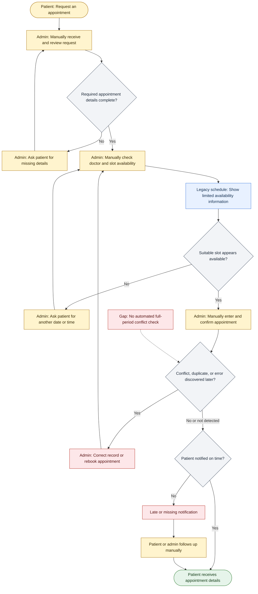
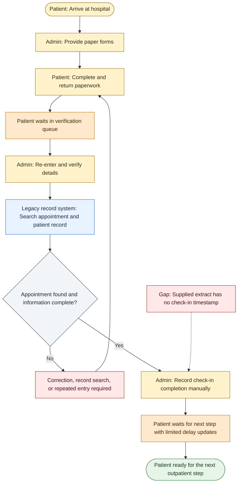
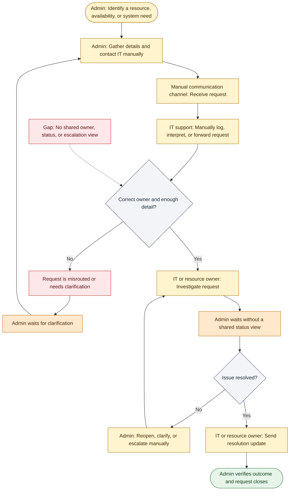
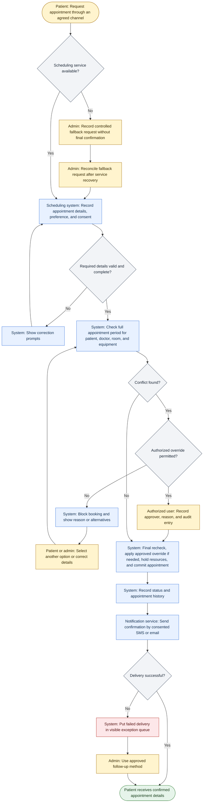
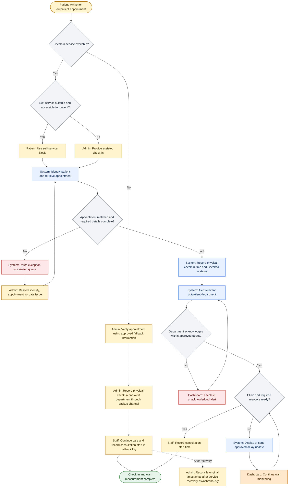
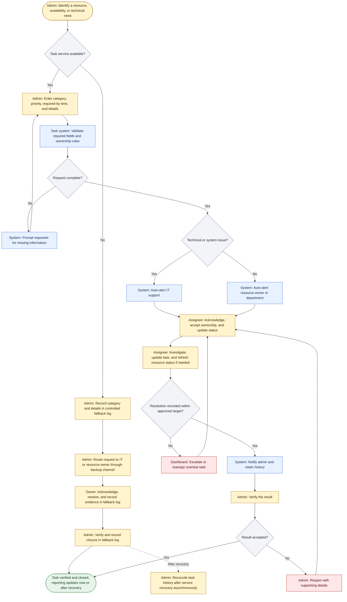

# Process Model Document

| Document field    | Details                                                                                              |
| ----------------- | ---------------------------------------------------------------------------------------------------- |
| File name         | `Capstone_Project_M03L01_Process_Model.md`                                                           |
| Project           | HealthFirst Care - Patient Experience and Operational Efficiency Initiative                          |
| Version           | 0.1                                                                                                  |
| Document status   | Draft for stakeholder review                                                                         |
| Processes modeled | Appointment scheduling; patient check-in; interdepartmental resource/technical request communication |
| Model notation    | Mermaid flowcharts                                                                                   |

## 1. Executive summary

This document provides draft As-Is and proposed To-Be process models for three HealthFirst Care workflows: appointment scheduling, patient check-in, and communication between administrative staff, IT, and resource-owning departments. The models respond to reported double bookings, limited availability visibility, difficult online booking, long waits, late notifications, disconnected systems, and weak departmental handoffs. [SRC-01, SRC-02, SRC-04]

The main proposed improvements are:

- automated full-period appointment conflict checking and recorded notification delivery;
- self-service kiosk check-in with an assisted route, timestamp capture, department alerts, and delay updates; and
- a structured task dashboard that routes technical issues to IT and operational resource needs to the responsible department or resource owner.

The current-state models are not verified observations. The lab supplies simulated manual steps for booking, check-in, and admin-to-IT communication. The stakeholder profiles support the reported problems, but the CSV files do not contain the event timestamps, duration, resource assignments, or request histories needed to prove the workflow sequence or measure the bottlenecks. The models must therefore be validated through stakeholder walkthroughs, observation, system review, and a representative operational data extract.

The kiosk, automatic check-in alert, and general task-management capability are not explicit approved requirements in the current RTM. They are shown because the lab requests them, but they remain change candidates until HealthFirst Care completes scope, cost, security, accessibility, integration, and operational review.

## 2. Analysis basis and evidence limits

### 2.1 Evidence classification

| Evidence type | Meaning in this document |
| --- | --- |
| Data observation | A descriptive result calculated from a supplied CSV file. It does not establish a cause or hospital-wide rate. |
| Stakeholder-reported issue | A concern reported in the small stakeholder-profile sample. It requires validation with wider representation. |
| Lab-simulated step | A current-state activity supplied by the lab instructions rather than directly observed or measured. |
| Proposed To-Be step | A future-state design option that must be validated, approved, tested, and piloted before implementation. |

### 2.2 Data insights used in the models

| Source | Relevant finding | Process use and limitation |
| --- | --- | --- |
| `appointment_data.csv` | 20 records: 8 `Completed` and 4 each `No Show`, `Rescheduled`, and `Cancelled`. No exact doctor/date/time duplicate appears, and each of five times occurs four times. | Supports questions about status handling, rescheduling, and cancellation. It does not prove a peak, scheduling delay, system failure, or overlapping booking. Duration, request/booking timestamps, resources, history, and overrides are missing. [SRC-06] |
| `feedback_data.csv` | 15 responses with mean 7.00; six scores are 5 or 6. One comment says "Long wait times" and one says "Delayed response." | Supports further patient investigation. Neither comment identifies the check-in process, delay stage, cause, or communication channel. [SRC-07] |
| `resource_data.csv` | 10 records: 4 `Available`, 2 `Unavailable`, 2 `In Use`, and 2 `Under Maintenance`. | Supports resource-status definition questions. It cannot establish capacity, demand, shortages, or response delays because departments, time intervals, reservations, request history, and ownership are missing. [SRC-08] |

### 2.3 Current-state analysis summary

| Workflow | Reported or simulated challenge | Likely effect | Evidence confidence |
| --- | --- | --- | --- |
| Appointment scheduling | Difficult online booking, reported double bookings/overbooking, limited current availability visibility, manual handling, late notifications | Rework, uncertainty, scheduling conflicts, delayed confirmation, and poorer patient experience | Problems are stakeholder-reported; exact manual sequence is lab-simulated; frequency is not measurable from the sample |
| Patient check-in | Manual paperwork, manual verification, record retrieval delay, long waits, and limited delay updates | Repeated entry, verification queue, incomplete wait data, and patient frustration | Long waits are reported; paperwork/verification sequence is lab-simulated; the delay stage and cause are unproven |
| Interdepartmental communication | Manual contact, disconnected systems, unclear ownership, delayed updates, weak handoffs, and no shared status | Misrouting, repeated follow-up, slow resolution, duplicate effort, and limited accountability | Communication problems are reported; the admin-to-IT route is lab-simulated; acknowledgement/resolution times are unavailable |

## 3. Process-model notation

Each Mermaid model uses the following conventions:

| Symbol or color | Meaning |
| --- | --- |
| Rounded start/end node | Process trigger or outcome |
| Rectangle | Task or system activity |
| Diamond | Decision or control point |
| Yellow | Manual activity |
| Blue | System or automated activity |
| Orange | Waiting or queue time |
| Red | Issue, rework, exception, or bottleneck |
| Green | Completed outcome |

Role names are included at the start of task labels. Dashed connectors identify an annotation, gap, or asynchronous post-recovery activity rather than the normal process flow.

## 4. As-Is process models

### 4.1 AS-IS-SCH-01: Appointment scheduling

This model follows the lab-simulated path from patient request through manual booking and notification. Stakeholder profiles support difficult booking, limited doctor-availability visibility, reported double bookings, overbooked schedules, and late notices. The supplied appointment extract cannot confirm the manual steps or calculate overlap frequency. [SRC-01, SRC-06]

Key As-Is findings:

- Availability checking and entry are modeled as manual, creating several opportunities for rework.
- A conflict may be detected after confirmation because the simulated process has no automated full-period patient, doctor, room, or equipment check.
- In the lab-simulated flow, notification may require manual follow-up, consistent with reported late cancellation and delay information.
- The process needs validation for actual channels, fields, approval rules, exception handling, and system behavior.

### 4.2 AS-IS-CHK-01: Patient check-in

The manual paperwork and verification queue are lab-simulated. Patients report long waits and limited updates, and administrative staff report slow record retrieval, but the sources do not establish that paperwork causes the wait. The appointment file has no arrival, check-in, or consultation-start timestamps. [SRC-01, SRC-02, SRC-06]

Key As-Is findings:

- Manual paperwork and repeated entry are a lab-defined bottleneck hypothesis, not a confirmed observation.
- Missing or mismatched information creates a rework loop and may increase verification time.
- The model separates verification waiting from the later wait for the next step so the actual delay source can be measured.
- No current dataset can calculate arrival-to-check-in or check-in-to-consultation time.

### 4.3 AS-IS-COM-01: Admin-to-IT and interdepartmental communication

This model follows the lab-simulated admin-to-IT route. Stakeholders report disconnected systems, downtime, incomplete scheduling information, delayed results, weak handoffs, and repeated follow-up. The source material does not confirm that IT owns all resource requests; operational requests may belong to a resource owner or department. [SRC-01, SRC-02, SRC-04]

Key As-Is findings:

- A request may be delayed by incomplete details, unclear ownership, manual forwarding, and repeated follow-up.
- Administrative staff have no modeled shared view of acknowledgement, owner, priority, progress, or expected completion.
- Operational resource issues should not be assumed to belong to IT.
- No supplied file contains request, acknowledgement, assignment, resolution, escalation, or closure timestamps.

## 5. To-Be process models

### 5.1 TO-BE-SCH-01: Automated appointment scheduling

The proposed workflow automates validation, full-period conflict checking, resource checking, confirmation, and delivery-status capture while keeping phone and in-person support. It aligns mainly with OBJ-02 to OBJ-05; FR-01, FR-02, FR-04 to FR-06, and FR-08; NFR-01 to NFR-03 and NFR-05; and AC-02 to AC-04. Rescheduling and cancellation under FR-03 require a related lifecycle model and are not shown in this initial-booking flow. [SRC-02, SRC-03]

Controls and expected impact:

- Required-field validation and a final recheck reduce incomplete records and race-condition conflicts.
- Full-period checks cover the patient, doctor, room, and required equipment; authorized overrides require a reason and audit record under the approved rule.
- Notification delivery failures become visible work rather than silent failures. "Real-time" must be replaced by an approved, measurable timing target.
- A tested fallback records requests during an outage but does not issue a final confirmation until reconciliation and conflict checking occur.
- Expected impact: fewer unauthorized overlaps, faster confirmation, more reliable notifications, and less administrative rework. Operational baselines remain TBD.

### 5.2 TO-BE-CHK-01: Streamlined patient check-in

This proposed model uses a self-service kiosk with an assisted route. It records physical check-in time, alerts the relevant outpatient department, provides delay updates, and captures consultation start for the approved wait calculation. It supports OBJ-01 and OBJ-04 and relates to FR-05 to FR-07 and FR-11; NFR-01 to NFR-03 and NFR-05; and AC-01, AC-03, AC-06, and AC-07. The kiosk and acknowledgement workflow are not explicit current requirements and need change approval. [SRC-02, SRC-03, SRC-05]

Controls and expected impact:

- Patients use a kiosk only when it is available, secure, usable, and accessible; staff-assisted check-in remains available.
- Exceptions cover a missing appointment, mismatched identity, incomplete data, late/unscheduled arrival, and duplicate check-in.
- The physical check-in timestamp is separate from any future online pre-check-in so the wait measure is not distorted.
- During an outage, staff can verify, check in, notify the department, and continue care through the approved fallback; system reconciliation occurs later without holding the patient until recovery.
- Department acknowledgement and escalation targets, kiosk privacy controls, staff override, and outage reconciliation remain to be defined.
- Expected impact: less repeated paperwork, faster exception routing, improved queue visibility, more complete wait data, and better delay communication. The BRD proposes a 20% eligible-wait target, but the target, baseline, and measurement rules remain pending approval; other targets are TBD.

### 5.3 TO-BE-COM-01: Structured interdepartmental task and resource communication

The proposed workflow uses a structured task tool or dashboard. It routes technical/system issues to IT and operational resource needs to the correct resource owner or department. It aligns mainly with OBJ-03 to OBJ-05; FR-08, FR-09, and FR-11; NFR-02, NFR-03, and NFR-05; and AC-08. The generic task-routing, acknowledgement, escalation, reopen, and verification functions extend the current RTM detail and require approval. [SRC-02, SRC-03, SRC-05]

Controls and expected impact:

- Structured fields reduce clarification loops and allow routing by category rather than sending every resource request to IT.
- Each task has an owner, status, timestamps, priority, history, verification, and a controlled reopen path.
- Acknowledgement, escalation, overdue, and resolution targets are TBD and must be approved by the responsible teams.
- During an outage, the backup channel allows acknowledgement, resolution, and verification to continue; the task history is reconciled after service recovery.
- Urgent clinical issues must use the existing clinical escalation route and must not wait in a general task queue.
- Expected impact: fewer lost or misrouted requests, clearer accountability, less manual follow-up, and measurable acknowledgement and resolution time.

## 6. As-Is to To-Be findings

| Workflow | Main As-Is gap | To-Be response | Anticipated impact | Validation needed |
| --- | --- | --- | --- | --- |
| Appointment scheduling | Manual checking/entry, fragmented availability, late conflict discovery, and manual notification follow-up | Validated fields, full-period conflict checks, final recheck/hold, status history, delivery tracking, visible exceptions, and outage reconciliation | Fewer unauthorized overlaps and incomplete records; faster, more reliable confirmation; less rework | Confirm rules, integration, concurrent-booking behavior, notification target, override authority, and operational baseline |
| Patient check-in | Paperwork and verification queue, repeated entry, limited status updates, and missing timestamps | Kiosk plus assisted path, automated record match, exception routing, physical check-in timestamp, department alert, delay update, and consultation-start capture | Shorter check-in handling, better queue visibility, improved wait measurement, and clearer patient communication | Observe actual check-in; confirm kiosk feasibility, privacy/accessibility, exceptions, acknowledgement target, and baseline timestamps |
| Interdepartmental communication | Manual contact, unclear ownership, no shared status, repeated follow-up, and weak closure | Structured request, category-based routing, auto-alert, owner/status, escalation, evidence, requester verification, and reporting | Faster acknowledgement and resolution; fewer misrouted or lost requests; clearer accountability | Confirm current channels, ownership model, existing tool capability, urgent escalation, data access, and service targets |

The expected impacts are hypotheses to be tested in UAT and pilot. The supplied data is not sufficient to promise these operational outcomes.

## 7. Proposed process measures

| Workflow | Measure | Current baseline | Proposed use |
| --- | --- | --- | --- |
| Scheduling | Request-to-confirmation time | Not available | Measure booking-cycle improvement by channel and exception type |
| Scheduling | Unauthorized overlap test pass rate | Test baseline only | Draft AC-02 specifies that all unauthorized overlap test scenarios are blocked |
| Scheduling | Override rate and reason completeness | Not available | Monitor rule effectiveness and use of authorized exceptions |
| Scheduling | Notification generation, delivery, and exception rate | Not available | Confirm AC-03 and identify failed-contact follow-up work |
| Check-in | Arrival-to-Checked-In time | Not available | Separate check-in processing delay from the later clinical wait |
| Check-in | Check-in and consultation-start timestamp completeness | Not available | Support reliable wait calculation and missing-data reporting |
| Check-in | Average eligible patient wait time | Baseline TBD | Measure the proposed 20% reduction if approved, using agreed rules and periods |
| Check-in | Self-service completion and assisted-fallback rate | Not available | Test kiosk usability, accessibility, and support demand if approved |
| Communication | Request acknowledgement and assignment time | Not available | Measure responsiveness by request category and owner |
| Communication | Resolution time and overdue-task rate | Not available | Monitor service performance after targets are approved |
| Communication | Misroute, reopen, and verified-closure rate | Not available | Identify routing, quality, and ownership problems |
| Communication | Resource-status freshness and missing-field rate | Not available | Monitor the quality of dashboard information |

## 8. Scope and requirement change candidates

These candidates should follow the change process in the Project Scope Management Plan before they are added to the approved baseline.

| Candidate ID | Proposed capability | Why change control is required | Minimum assessment |
| --- | --- | --- | --- |
| PCM-01 | Self-service kiosk check-in | FR-04 and NFR-01 cover appointment booking, not a check-in kiosk. Hardware purchasing may also conflict with the exclusion of major equipment purchases. | Process need, kiosk or existing-device option, cost, procurement, accessibility, privacy, security, support, training, outage, and acceptance criteria |
| PCM-02 | Automatic department alert, acknowledgement, and escalation after check-in | The current RTM does not explicitly define this check-in event workflow. | Trigger, recipients, ownership, target time, status, audit, failure handling, data access, and testing |
| PCM-03 | General task-management dashboard with routing and service targets | FR-08, FR-09, and FR-11 support resource/status visibility but do not fully define task routing, acknowledgement, SLA escalation, reopen, verification, and reporting. | Existing-tool reuse, integration, procurement, categories, owners, status rules, targets, controls, support, and cost |
| PCM-04 | Measurable "real-time" or "immediate" behavior | Notification, resource refresh, acknowledgement, and performance timing targets are currently TBD. | Define each event, start/end timestamp, target, exception, owner, evidence, and monitoring approach |

Likely requirement refinements within the current business need include a final atomic slot recheck/temporary hold under FR-02 and notification retry/exception handling under FR-05. The BRD, RTM, process models, test cases, and scope baseline must be updated if the authorized approver accepts these refinements.

## 9. Model validation plan and open questions

### 9.1 Validation activities

1. Walk through AS-IS-SCH-01 with appointment schedulers, representative patients, doctors, and resource owners.
2. Observe the outpatient check-in process with appropriate consent and privacy controls; record actual steps, queues, exceptions, systems, and timestamps.
3. Walk through AS-IS-COM-01 with administrative staff, IT support, and operational resource owners to confirm channels, routing, ownership, escalation, and closure.
4. Review system configuration, forms, logs, and standard procedures to distinguish actual workflow from reported workarounds.
5. Obtain representative operational extracts containing the event fields listed in Section 7.
6. Update the process models, BRD, RTM, data definitions, and scope-change candidates after decisions are recorded.
7. Validate To-Be normal, exception, outage, accessibility, security, and recovery scenarios through demonstrations, UAT, and pilot.

### 9.2 Open questions

- Which appointment channels are currently used, and where does manual re-entry occur?
- What fields are mandatory, and who can override an appointment conflict?
- How are duration, buffers, rooms, and equipment currently assigned?
- What is the actual arrival, paperwork, verification, check-in, and consultation sequence?
- Which check-in exceptions occur most often, and which require staff authorization?
- Can an existing device or portal support self-service check-in without major new equipment?
- Which department owns each resource or technical request category?
- Which current ticketing or task tool could be configured before considering a new purchase or integration?
- What acknowledgement, notification, resource-refresh, performance, and escalation targets should apply?
- Which privacy, security, accessibility, consent, retention, and audit controls are required?
- What manual fallback and recovery reconciliation steps are approved for each workflow?

## 10. Validation checklist

| Validation check | Result | Notes |
| --- | --- | --- |
| Three required As-Is workflows are modeled | Complete - draft | Scheduling, check-in, and interdepartmental communication are included. |
| Current-state bottlenecks, waits, decisions, and rework are visible | Complete - validation required | Manual and issue nodes highlight the simulated and reported gaps. |
| Three required To-Be workflows are modeled | Complete - proposed | Automation, self-service check-in, notifications, dashboard routing, and verification are included. |
| Manual tasks and decision points use consistent Mermaid notation | Complete | Yellow tasks and diamond decisions are used consistently. |
| To-Be models include exceptions and outage fallback | Complete | Each model includes correction, failure, or fallback paths. |
| Models align with BRD objectives and RTM requirements | Complete | Traceability is described before each To-Be model. |
| Data findings and limitations are documented | Complete | Section 2 distinguishes evidence from assumptions. |
| New scope is identified | Complete | Section 8 lists four process-model change candidates. |
| Expected impacts are not overstated | Complete | Impacts are described as anticipated and require UAT/pilot validation. |
| Measures and missing baselines are documented | Complete | Section 7 identifies the required process data. |
| Stakeholder validation activities are defined | Complete | Section 9 provides walkthrough, observation, data, UAT, and pilot actions. |

## 11. Source register

| Source ID | Source                                                         |
| --------- | -------------------------------------------------------------- |
| SRC-01    | `Stakeholders Profile_for Requirement Gathering.docx`          |
| SRC-02    | `Capstone_Project_M01L01_BRD.md`, version 0.1                  |
| SRC-03    | `Capstone_Project_M01L02_RTM.md`, version 0.1                  |
| SRC-04    | `Capstone_Project_M02L01_Stakeholder_Analysis.md`, version 0.1 |
| SRC-05    | `Capstone_Project_M02L02_Scope_Management.md`, version 0.1     |
| SRC-06    | `appointment_data.csv`                                         |
| SRC-07    | `feedback_data.csv`                                            |
| SRC-08    | `resource_data.csv`                                            |
