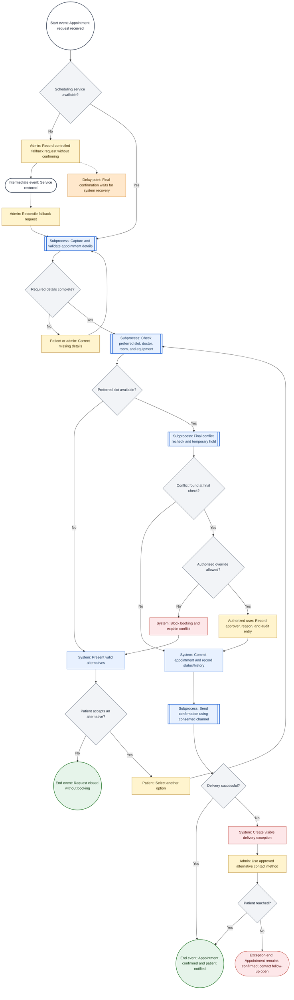
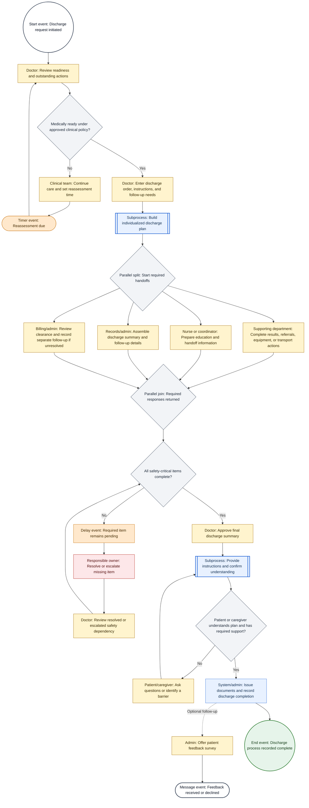

# Detailed Process Maps Report

| Document field     | Details                                                                                       |
| ------------------ | --------------------------------------------------------------------------------------------- |
| File name          | `Capstone_Project_M03L02_Swimlane_Diagrams.md`                                                |
| Project            | HealthFirst Care - Patient Experience and Operational Efficiency Initiative                   |
| Version            | 0.1                                                                                           |
| Document status    | Draft for stakeholder review                                                                  |
| Primary references | BRD version 0.1; RTM version 0.1; Stakeholder Analysis version 0.1; Process Model version 0.1 |
| Experience level   | One year of business analysis experience                                                      |

## 1. Executive summary

This report provides detailed process maps for three multi-role workflows at HealthFirst Care:

1. appointment scheduling and confirmation;
2. patient check-in and appointment-related resource allocation; and
3. discharge planning.

For each workflow, the report includes an advanced BPMN-style process view and a role-based swimlane view encoded in Mermaid. The models use event triggers, tasks, gateways, subprocesses, exceptions, handoffs, and end events. Mermaid flowcharts approximate BPMN concepts; they are not executable BPMN 2.0 models.

The scheduling maps are based on the proposed To-Be process and draft requirements for validated appointment details, full-period conflict checks, resource visibility, status history, notifications, and outage recovery. The check-in and resource maps build on the proposed To-Be model, but self-service check-in and automatic department acknowledgement are still scope-change candidates. The discharge maps are included to meet this lab requirement; they are **illustrative discovery models**, not approved HealthFirst Care scope. No supplied requirement, dataset, or previous process model defines a discharge workflow.

The diagrams clarify who performs each task, where information changes hands, which decisions require an owner, and where delay or rework may occur. Expected improvements are stated as hypotheses for stakeholder walkthroughs, user acceptance testing, and pilot measurement rather than as proven benefits.

## 2. Purpose, scope, and analysis basis

### 2.1 Purpose

The purpose of these maps is to support stakeholder validation of process sequence, ownership, handoffs, exceptions, and controls. The maps should help the project team:

- confirm that each task has a responsible role;
- identify manual handoffs and unclear ownership;
- validate business rules at gateways;
- identify missing information, controls, and timing targets;
- connect proposed process steps to draft requirements; and
- identify work that needs formal scope approval before delivery.

### 2.2 Workflow status and project boundary

| Workflow | Model status | Current scope position | Decision required |
| --- | --- | --- | --- |
| Appointment scheduling and confirmation | Proposed To-Be, based on the prior process model | Mainly within the draft BRD and RTM | Approve business rules, owners, timing targets, fallback, and requirement refinements |
| Patient check-in and resource allocation | Proposed To-Be with unapproved extensions | Timestamp capture and appointment-related resource visibility are within draft scope; kiosk check-in and department acknowledgement/escalation are change candidates | Decide whether to approve the kiosk and alert workflow through scope change control |
| Discharge planning | Illustrative, lab-simulated discovery model | Outside the outpatient appointment boundary; no current BRD/RTM coverage | Sponsor must approve discovery or a scope change before detailed design or delivery |

The current project excludes emergency and inpatient workflow redesign, clinical diagnosis and treatment decisions, prescription-management redesign, hospital-wide workforce/bed/supply planning, and billing-policy redesign. The discharge maps therefore show a possible coordination pattern only. They do not define clinical policy or authorize a system change. [SRC-02, SRC-03, SRC-05, SRC-09]

### 2.3 Evidence classification

| Evidence type | How it is used |
| --- | --- |
| Stakeholder-reported issue | Used to identify needs such as difficult booking, reported double bookings, overbooked schedules, unavailable resources, late updates, delayed results, and weak handoffs |
| Supplied CSV observation | Used only for exact descriptive results and missing-field analysis |
| Prior draft requirement or model | Used for traceability; all RTM requirements remain Pending |
| Lab-simulated step | Included because the lab requests the workflow, but labeled for validation rather than presented as observed fact |
| Proposed control | Included in the To-Be model and subject to business, technical, privacy/security, accessibility, and scope approval |

### 2.4 Data findings used in the maps

| Data source | Verified observation | Process-model use and limitation |
| --- | --- | --- |
| `appointment_data.csv` | 20 records: 8 Completed (40%) and 4 each No Show, Rescheduled, and Cancelled (20% each). Each of five appointment times occurs four times. No exact doctor/date/time duplicate appears. | Supports status handling and the need to test conflict rules. It does not establish a peak, booking delay, or true overlap because duration, resource assignment, booking timestamps, and history are absent. |
| `feedback_data.csv` | 15 responses; mean and median score 7; range 5-9. One comment mentions long waits and one mentions a delayed response (1/15 or 6.7% each). | Supports investigating waiting and communication. It does not identify the process stage, duration, or cause and contains no discharge event. |
| `resource_data.csv` | 10 records: 4 Available, 2 Unavailable, 2 In Use, and 2 Under Maintenance. | Supports explicit resource-status decisions. It cannot prove shortage or utilization because capacity, demand, department, time interval, appointment linkage, and assignment history are missing. |

The feedback file has no `AppointmentID`. Apparent matches by patient, date, or department should not be used to link feedback to an appointment outcome without an agreed encounter key and data-definition review. [SRC-06, SRC-07]

## 3. Stakeholders, handoffs, and ownership

### 3.1 Roles represented in the models

| Role or department | Main responsibility shown in the maps | Validation focus |
| --- | --- | --- |
| Patient or caregiver | Submit information, select options, receive messages, use or request assisted service, confirm understanding | Usability, accessibility, consent, communication preference, and acceptable wait/update experience |
| Administrative staff / front desk | Capture requests, resolve data exceptions, support patients, manage notification exceptions, and maintain fallback records | Required fields, exception authority, status definitions, rework, and recovery ownership |
| Doctors | Maintain schedule inputs, confirm readiness, begin consultations, and provide clinical authorization where applicable | Duration, buffer, readiness, handoff, and clinical decision boundaries |
| Nurses / clinical department | Acknowledge patient status, coordinate readiness, prepare patients, and perform discharge-coordination steps in the illustrative model | Alert ownership, resource readiness, escalation, education, and handoff rules |
| Resource owner | Maintain room/equipment status and resolve an appointment-related resource exception | Status definitions, update frequency, assignment rules, and accountable owner |
| IT team / system support | Support technical availability, integration, recovery, access, audit, and system exceptions | IT owns technical service issues, not every operational resource decision |
| Billing / records staff | Handle approved appointment-data exceptions and the illustrative non-clinical discharge administration | Data completeness, exception ownership, record status, and policy boundary |
| Hospital leadership / sponsor | Approve scope, funding, priorities, material rules, risk acceptance, and release | Discharge scope, kiosk/alert change candidates, targets, and unresolved ownership |

### 3.2 Critical handoffs

| Handoff ID | From | To | Information or outcome transferred | Main risk or open point |
| --- | --- | --- | --- | --- |
| H-01 | Patient | Administrative staff or scheduling service | Appointment request, required details, channel preference, and consent | Missing information or assisted-channel need |
| H-02 | Scheduling service | Patient / admin | Available options or conflict explanation | Availability may be stale; duration, buffer, and override rules are TBD |
| H-03 | Scheduling service | Notification service / admin | Confirmed appointment and delivery result | Failed-delivery owner and timing target are TBD |
| H-04 | Patient | Front desk / check-in service | Arrival, identity, and appointment information | Identity mismatch, missing appointment, duplicate check-in, or accessibility need |
| H-05 | Check-in service | Clinical department | Checked-In status, physical check-in time, and appointment details | Acknowledgement owner and escalation target are unapproved |
| H-06 | Clinical department / resource owner | Patient and front desk | Readiness, delay reason, estimated next update, or reschedule option | Update cadence and safe escalation route are TBD |
| H-07 | Doctor | Nurse / coordinator and administration | Discharge request, instructions, and outstanding actions | Illustrative only; trigger, accountability, and policy are not validated |
| H-08 | Supporting department | Doctor / coordinator | Result, referral, equipment, or other dependency status | Completion evidence and escalation ownership are unknown |
| H-09 | Nurse / administration | Patient or caregiver | Discharge summary, instructions, follow-up, and contact route | Understanding, accessibility, consent, and clinical safety need validation |
| H-10 | Administration / billing | Records and patient | Administrative clearance or separate follow-up for an unresolved non-clinical item | Billing must not be assumed to determine clinical readiness |

### 3.3 Known bottlenecks and ownership gaps

| Area | Reported or modeled issue | Ownership clarification needed |
| --- | --- | --- |
| Scheduling | Manual checks, fragmented availability, late conflict discovery, and notification follow-up may create rework | Scheduling process owner, override approver, resource-status owner, and notification-exception owner |
| Check-in | Paperwork, record lookup, exceptions, and waiting are lab-simulated bottleneck hypotheses; the cause of reported waits is not known | Check-in process owner, exception authority, department-alert owner, and fallback-reconciliation owner |
| Resource allocation | A status may be missing, stale, or insufficient to show whether a resource is suitable for the appointment period | Each resource owner, refresh rule, readiness decision, and overdue-escalation owner |
| Interdepartmental handoff | Stakeholders report delayed results, referrals, and transfer updates | Requester, responsible department, required status, timestamp, and escalation path |
| Discharge | No validated sequence, actor list, timing, rule, data, or metric is supplied | All accountable and responsible roles must be confirmed through discovery |

## 4. BPMN-to-Mermaid notation

Mermaid does not provide a native BPMN 2.0 execution engine. The diagrams use the following visual equivalents so stakeholders can review the business flow in Markdown.

| BPMN concept | Mermaid representation | Meaning in this report |
| --- | --- | --- |
| Start or end event | Circular node | Event that starts the workflow or an outcome that ends a path |
| Intermediate message or timer event | Rounded node | Message received, recovery, time target reached, or other event during the process |
| Task | Rectangle | Work completed by a person, team, or system |
| Subprocess | Double-bordered rectangle | Group of related tasks summarized at this level |
| Exclusive gateway | Diamond | One path is selected based on an approved rule |
| Parallel split or join | Diamond labeled as parallel | Branches should start together or all required branches should complete; Mermaid does not enforce this behavior |
| Swimlane | Mermaid `subgraph` | Role or department that owns the activities inside the lane |
| Dashed connector | Dotted arrow | Annotation, reference-data input, or asynchronous post-recovery/optional activity rather than the normal immediate sequence |

Color conventions are consistent across all diagrams: yellow is a human task, blue is a system task, gray is a gateway, orange is a wait or delay, red is an exception, and green is a completed outcome.

## 5. Advanced BPMN-style process diagrams

### 5.1 BPMN-SCH-01: Appointment scheduling and confirmation

**State:** Proposed To-Be process.  
**Trigger:** An appointment request is received through an agreed channel.  
**Outcome:** The appointment is confirmed and the delivery result is recorded, or the request closes without a booking.

Key controls and rules:

- A fallback request is not confirmed until service recovery, validation, conflict checking, and resource checking are complete.
- The final recheck and temporary hold reduce the risk that availability changes between the first check and saving the appointment.
- An override is allowed only under an approved rule and must store the approver, reason, and audit record.
- A notification failure does not cancel a valid appointment; it creates separate follow-up work.
- Rescheduling and cancellation are governed by FR-03 but require a separate appointment-lifecycle map.

Traceability: OBJ-02 to OBJ-04; FR-01, FR-02, FR-04 to FR-06, and FR-08; NFR-01 to NFR-03 and NFR-05; AC-02 to AC-04. Appointment duration, buffer rules, override authority, notification timing, and recovery ownership remain TBD. The temporary hold and detailed delivery-exception process are requirement refinements requiring approval. [SRC-02, SRC-03, SRC-05]

### 5.2 BPMN-CHK-01: Patient check-in and resource allocation

**State:** Proposed To-Be process with scope-change candidates.  
**Trigger:** A patient physically arrives for an outpatient appointment.  
**Outcome:** The consultation starts and the timestamps are captured, or a rescheduling request is handed to the scheduling process.

```mermaid
flowchart TD
    A(("Start event: Patient arrives")):::event
    B{"Check-in service available?"}:::gateway
    C["Front desk: Verify appointment and record original check-in time/status in fallback log"]:::task
    D["Front desk: Alert clinical department through backup channel"]:::task
    AH["Clinical team/resource owner: Confirm readiness using proposed fallback rules"]:::task
    AK{"Ready to proceed under fallback?"}:::gateway
    AI["Doctor and staff: Start consultation and record original time in fallback log"]:::task
    E(("End event: Consultation started through fallback; reconciliation pending")):::outcome
    AL["Clinical team/front desk: Record delay and initiate proposed fallback option"]:::exception
    AM(("End event: Fallback exception or rescheduling handoff recorded")):::outcome
    F["Front desk: Reconcile original timestamps after recovery"]:::task
    G{"Self-service suitable and accessible?"}:::gateway
    H["Patient: Use self-service check-in"]:::task
    I["Front desk: Provide assisted check-in"]:::task
    J[["Subprocess: Identify patient and validate appointment"]]:::subprocess
    K{"Appointment matched and details complete?"}:::gateway
    L["System: Route mismatch to assisted exception queue"]:::exception
    M["Front desk: Resolve identity, appointment, or data issue"]:::task
    N{"Exception resolved?"}:::gateway
    O["Front desk: Escalate or arrange an approved appointment option"]:::exception
    P(("End event: Exception outcome recorded")):::outcome
    Q["System: Record physical check-in time and Checked In status"]:::system
    R["System: Alert relevant clinical department"]:::system
    S{"Department acknowledges within approved target?"}:::gateway
    T["Dashboard: Escalate unacknowledged alert"]:::exception
    TA["Clinical lead: Acknowledge or assign an owner"]:::task
    U[["Subprocess: Check clinician, room, and equipment readiness"]]:::subprocess
    V{"Required resources ready?"}:::gateway
    W[["Subprocess: Assign owner and resolve resource exception"]]:::subprocess
    X{"Resolved within approved target?"}:::gateway
    Y["Timer event: Resource target missed"]:::delay
    Z["System: Send approved delay or reschedule options"]:::system
    AA{"Patient continues to wait?"}:::gateway
    AB["Patient: Wait with monitored status and updates"]:::delay
    AJ[["Subprocess: Create rescheduling request and hand off to scheduling"]]:::subprocess
    AC(("End event: Rescheduling handoff recorded")):::outcome
    AD["Nurse or department: Prepare patient and required resources"]:::task
    AE["Doctor: Start consultation"]:::task
    AF["System: Store consultation-start time entered by authorized staff"]:::system
    AG(("End event: Consultation started and wait data captured")):::outcome

    A --> B
    B -->|No| C --> D --> AH --> AK
    AK -->|Yes| AI --> E
    AK -->|No| AL --> AM
    AI -. After recovery .-> F
    AL -. After recovery .-> F
    B -->|Yes| G
    G -->|Yes| H --> J
    G -->|No| I --> J
    J --> K
    K -->|No| L --> M --> N
    N -->|Yes| J
    N -->|No| O --> P
    K -->|Yes| Q --> R --> S
    S -->|No| T --> TA --> U
    S -->|Yes| U --> V
    V -->|Yes| AD --> AE --> AF --> AG
    V -->|No| W --> X
    X -->|Yes| U
    X -->|No| Y --> Z --> AA
    AA -->|Yes| AB --> U
    AA -->|No| AJ --> AC

    classDef event fill:#FFFFFF,stroke:#344054,stroke-width:2px,color:#101828
    classDef task fill:#FFF4CE,stroke:#A66B00,color:#3D2A00
    classDef system fill:#E8F1FF,stroke:#2F6FDB,color:#123057
    classDef subprocess fill:#E8F1FF,stroke:#175CD3,stroke-width:2px,color:#123057
    classDef gateway fill:#F2F4F7,stroke:#475467,color:#1D2939
    classDef delay fill:#FFE8CC,stroke:#C76B00,color:#4A2A00
    classDef exception fill:#FDE7E9,stroke:#B42318,color:#5A0F0F
    classDef outcome fill:#E6F4EA,stroke:#2E7D32,stroke-width:2px,color:#123D16
```

Key controls and rules:

- The physical-arrival/check-in timestamp must remain separate from any online pre-check-in timestamp.
- An assisted route remains available for accessibility, identity, appointment, and data exceptions.
- Proposed resource-readiness criteria for validation include suitability, location, appointment period, maintenance, cleaning, and existing commitments rather than only an `Available` label.
- The waiting loop needs an approved update cadence and escalation owner so it cannot continue indefinitely.
- During an outage, the original time is retained in the fallback log and reconciled after recovery; the recovery time must not replace it.

Traceability: OBJ-01, OBJ-03, and OBJ-04; FR-07, FR-08, and partial FR-11; NFR-01, NFR-03, and NFR-05; AC-04 and partial AC-01/AC-06. The delay-message step provides only partial FR-05/AC-03 support because preference/consent, channel selection, delivery logging, and failed-delivery handling are not shown. NFR-02/AC-07 are cross-cutting access and audit controls that must be tested separately; they are not depicted. AC-01 still requires an approved baseline and post-implementation result. Self-service check-in and automatic department acknowledgement/escalation remain change candidates PCM-01 and PCM-02 until approved; the alert is not treated as approved FR-09 coverage. [SRC-02 to SRC-05]

### 5.3 BPMN-DIS-01: Discharge planning

**State:** Illustrative discovery model; untraced and outside the current project baseline.  
**Trigger:** A discharge request is initiated for review.  
**Outcome:** A coordinated discharge is recorded, instructions are acknowledged, and feedback is offered.

Model cautions:

- The gateway and tasks represent a lab-simulated coordination pattern and must not be treated as clinical policy.
- The parallel split/join means the required planning responses are expected to proceed concurrently and be accounted for before the next gateway. Mermaid does not enforce this behavior.
- Billing review is shown because the lab requests billing clearance. An unresolved non-clinical billing item is recorded for separate follow-up and must not be assumed to determine clinical readiness.
- Clinical readiness, results, medication, equipment, transport, patient education, caregiver support, documentation, escalation, and records rules require validation by authorized local stakeholders.

Traceability: **UNTRACED / scope-change candidate.** No current BRD objective, RTM requirement, acceptance criterion, WBS package, dataset, or earlier process model authorizes a discharge-planning solution. The profiles provide only adjacent reports about unclear next steps, prescription questions, delayed results, referrals, and transfer handoffs. Leadership must approve a new objective, requirements, owners, controls, funding, and acceptance measures before this model can become a target-state design. [SRC-01 to SRC-05, SRC-09]

## 6. Role-based swimlane diagrams

### 6.1 SWL-SCH-01: Appointment scheduling and confirmation ownership

This view assigns proposed scheduling tasks to the patient, administrative staff, scheduling technology/IT support, doctor/resource owner, and an authorized approval role that is still TBD. Cross-lane arrows are handoffs. Technical support does not replace business ownership of appointment information, resource status, or override decisions.

```mermaid
flowchart LR
    subgraph PAT["Lane: Patient"]
        direction TB
        P0(("Appointment requested")):::event
        PG0{"Staff assistance needed?"}:::gateway
        P1["Provide details, preference, and consent"]:::task
        P2["Correct missing details"]:::task
        P5["Select another slot"]:::task
        P3["Receive confirmation"]:::task
        P4(("Scheduling interaction complete")):::outcome
    end

    subgraph ADM["Lane: Administrative staff"]
        direction TB
        A0["Receive staff-assisted request"]:::task
        A1["Clarify missing information"]:::task
        A2["Record fallback request without confirming"]:::task
        A4["Handle notification-delivery exception"]:::task
        AG0{"Patient reached?"}:::gateway
        A5(["Exception end: Contact follow-up remains open"]):::exception
    end

    subgraph TECH["Lane: Scheduling technology / IT support"]
        direction TB
        SG0{"Service available?"}:::gateway
        S0["Validate required fields"]:::system
        SG1{"Details complete?"}:::gateway
        S1[["Check full period and required resources"]]:::subprocess
        SG2{"Conflict found?"}:::gateway
        SG4{"Resource-status information disputed or incomplete?"}:::gateway
        S2["Present reason and valid alternatives"]:::system
        S3[["Final recheck, hold, and commit"]]:::subprocess
        S4["Record status and history"]:::system
        N0["Send consented SMS or email"]:::system
        NG0{"Delivery successful?"}:::gateway
        N1["Create visible delivery exception"]:::exception
        I0["Monitor technical service"]:::system
        I1["Restore service and support reconciliation"]:::task
    end

    subgraph RES["Lane: Doctor / resource owner"]
        direction TB
        R0["Maintain schedule and resource status"]:::task
        R1["Confirm or correct disputed schedule/resource status"]:::task
    end

    subgraph APR["Lane: Authorized approver (TBD)"]
        direction TB
        AG1{"Override accepted under approved rule?"}:::gateway
        A3["Record approver, reason, and audit evidence"]:::task
    end

    P0 --> PG0
    PG0 -->|Yes| A0 --> P1
    PG0 -->|No| P1
    P1 --> SG0
    SG0 -->|No| A2 --> I1 --> S0
    SG0 -->|Yes| S0
    I0 -. Technical status .-> SG0
    S0 --> SG1
    SG1 -->|No| A1 --> P2 --> S0
    SG1 -->|Yes| S1
    R0 -. Availability reference .-> S1
    S1 --> SG2
    SG2 -->|No| S3
    SG2 -->|Yes| SG4
    SG4 -->|Yes| R1 --> S1
    SG4 -->|No| AG1
    AG1 -->|No| S2 --> P5 --> S0
    AG1 -->|Yes| A3 --> S3
    S3 --> S4 --> N0 --> NG0
    NG0 -->|Yes| P3 --> P4
    NG0 -->|No| N1 --> A4 --> AG0
    AG0 -->|Yes| P3
    AG0 -->|No| A5

    classDef event fill:#FFFFFF,stroke:#344054,stroke-width:2px,color:#101828
    classDef task fill:#FFF4CE,stroke:#A66B00,color:#3D2A00
    classDef system fill:#E8F1FF,stroke:#2F6FDB,color:#123057
    classDef subprocess fill:#E8F1FF,stroke:#175CD3,stroke-width:2px,color:#123057
    classDef gateway fill:#F2F4F7,stroke:#475467,color:#1D2939
    classDef delay fill:#FFE8CC,stroke:#C76B00,color:#4A2A00
    classDef exception fill:#FDE7E9,stroke:#B42318,color:#5A0F0F
    classDef outcome fill:#E6F4EA,stroke:#2E7D32,stroke-width:2px,color:#123D16
```

Delay and responsibility observations:

- The assisted patient-to-admin route may add delay when capture or clarification is needed; the self-service route bypasses that handoff.
- Resource status enters from the doctor/resource owner; IT should not be treated as the owner of operational availability.
- A fallback request waits for technical recovery before final confirmation, creating a controlled delay rather than a potentially conflicting booking.
- The authorized override and failed-delivery owner must be named before the workflow is approved.

### 6.2 SWL-CHK-01: Patient check-in and resource allocation ownership

This view separates physical arrival and assistance, system validation, clinical acknowledgement, and resource-status ownership. It prevents the general label "IT issue" from hiding an operational resource problem.

```mermaid
flowchart LR
    subgraph PAT["Lane: Patient"]
        direction TB
        P0(("Arrive for appointment")):::event
        PG0{"Self-service suitable and accessible?"}:::gateway
        P1["Use self-service check-in"]:::task
        P2["Receive delay or reschedule options"]:::task
        PG1{"Continue monitored wait?"}:::gateway
        P3["Wait with updates"]:::delay
        P4(("Rescheduling request handed to scheduling")):::outcome
        P5(("Consultation started")):::outcome
    end

    subgraph ADM["Lane: Front desk / administrative staff"]
        direction TB
        A0["Verify appointment; record original check-in time/status; send backup alert"]:::task
        A1["Provide assisted check-in"]:::task
        A2["Resolve identity, appointment, or data exception"]:::task
        A3["Reconcile original timestamps after recovery"]:::task
        A4["Create rescheduling request and hand off to scheduling"]:::task
    end

    subgraph SYS["Lane: Check-in and notification system"]
        direction TB
        SG0{"Service available?"}:::gateway
        S0["Identify patient and retrieve appointment"]:::system
        SG1{"Appointment matched and complete?"}:::gateway
        S1["Route exception to assisted queue"]:::exception
        S2["Record physical check-in time and status"]:::system
        S3["Alert clinical department"]:::system
        S4["Send approved delay update"]:::system
    end

    subgraph CLIN["Lane: Nurse / doctor / clinical department"]
        direction TB
        CG0{"Alert acknowledged within target?"}:::gateway
        C0["Acknowledge and accept patient readiness task"]:::task
        C1[["Assess clinician and care-area readiness"]]:::subprocess
        C2["Nurse/department: Prepare patient"]:::task
        C4["Doctor: Start consultation"]:::task
        C3["Record consultation-start time"]:::task
    end

    subgraph RES["Lane: Appointment-related resource owner"]
        direction TB
        R0["Maintain room and equipment status"]:::task
        RG0{"Required resources ready?"}:::gateway
        R1[["Resolve assignment or availability exception"]]:::subprocess
        RG1{"Resolved within approved target?"}:::gateway
        R2["Escalate delay and provide next-update time"]:::exception
    end

    P0 --> SG0
    SG0 -->|No| A0 --> C1
    A0 -. After recovery .-> A3
    SG0 -->|Yes| PG0
    PG0 -->|Yes| P1 --> S0
    PG0 -->|No| A1 --> S0
    S0 --> SG1
    SG1 -->|No| S1 --> A2 --> S0
    SG1 -->|Yes| S2 --> S3 --> CG0
    CG0 -->|No| C0 --> C1
    CG0 -->|Yes| C1
    R0 -. Status reference .-> RG0
    C1 --> RG0
    RG0 -->|Yes| C2 --> C4 --> C3 --> P5
    RG0 -->|No| R1 --> RG1
    RG1 -->|Yes| C1
    RG1 -->|No| R2 --> S4 --> P2 --> PG1
    PG1 -->|Yes| P3 --> C1
    PG1 -->|No| A4 --> P4

    classDef event fill:#FFFFFF,stroke:#344054,stroke-width:2px,color:#101828
    classDef task fill:#FFF4CE,stroke:#A66B00,color:#3D2A00
    classDef system fill:#E8F1FF,stroke:#2F6FDB,color:#123057
    classDef subprocess fill:#E8F1FF,stroke:#175CD3,stroke-width:2px,color:#123057
    classDef gateway fill:#F2F4F7,stroke:#475467,color:#1D2939
    classDef delay fill:#FFE8CC,stroke:#C76B00,color:#4A2A00
    classDef exception fill:#FDE7E9,stroke:#B42318,color:#5A0F0F
    classDef outcome fill:#E6F4EA,stroke:#2E7D32,stroke-width:2px,color:#123D16
```

Delay and responsibility observations:

- The front desk is proposed to own assisted check-in and data-exception resolution; the clinical department is proposed to own acknowledgement and patient readiness.
- The appointment-related resource owner is proposed to maintain operational status and resolve an allocation issue; IT support is needed only for a technical fault or outage.
- If the resource target is missed, the process produces a patient update and an explicit continue-wait or reschedule decision.
- The physical check-in and consultation-start timestamps support the proposed wait measure, but no current baseline exists.

### 6.3 SWL-DIS-01: Illustrative discharge-planning ownership

The lanes below show a possible division of work for workshop discussion. The role names, accountabilities, clinical rules, and data exchanges have not been confirmed by HealthFirst Care.

```mermaid
flowchart LR
    subgraph DOC["Lane: Doctor"]
        direction TB
        D0(("Discharge request initiated")):::event
        D1["Review readiness and outstanding actions"]:::task
        DG0{"Medically ready?"}:::gateway
        D2["Continue care and set reassessment"]:::task
        DT0["Wait until reassessment event"]:::delay
        D3["Enter discharge order and follow-up needs"]:::task
        D5["Review resolved or escalated safety dependency"]:::task
        D4["Approve final discharge summary"]:::task
    end

    subgraph NUR["Lane: Nurse / discharge coordinator"]
        direction TB
        N0[["Build individualized discharge plan"]]:::subprocess
        NG0{"Parallel split: Start handoffs"}:::gateway
        NG1{"Parallel join: Required responses returned"}:::gateway
        NG2{"All safety-critical items complete?"}:::gateway
        N1["Resolve or escalate missing item"]:::exception
        N2["Provide instructions and confirm understanding"]:::task
    end

    subgraph SUP["Lane: Supporting departments"]
        direction TB
        S0["Complete required results or referrals"]:::task
        S1["Confirm equipment, transport, or other approved support"]:::task
    end

    subgraph ADM["Lane: Records / administration / billing"]
        direction TB
        A0["Assemble summary and follow-up details"]:::task
        A1["Review billing clearance; separate unresolved non-clinical follow-up"]:::task
        A2["Issue documents and record completion"]:::system
        A3["Offer feedback survey"]:::task
    end

    subgraph PAT["Lane: Patient / caregiver"]
        direction TB
        P0["Review plan, instructions, warning signs, and contacts"]:::task
        PG0{"Plan understood and support available?"}:::gateway
        P1["Ask questions or identify a barrier"]:::task
        P2["Provide or decline feedback"]:::task
        P3(("Discharge process recorded complete")):::outcome
    end

    D0 --> D1 --> DG0
    DG0 -->|No| D2 --> DT0 --> D1
    DG0 -->|Yes| D3 --> N0 --> NG0
    NG0 --> S0
    NG0 --> S1
    NG0 --> A0
    NG0 --> A1
    S0 --> NG1
    S1 --> NG1
    A0 --> NG1
    A1 --> NG1
    NG1 --> NG2
    NG2 -->|No| N1 --> D5 --> NG2
    NG2 -->|Yes| D4 --> N2 --> P0 --> PG0
    PG0 -->|No| P1 --> N2
    PG0 -->|Yes| A2 --> P3
    A2 -. Optional follow-up .-> A3 --> P2

    classDef event fill:#FFFFFF,stroke:#344054,stroke-width:2px,color:#101828
    classDef task fill:#FFF4CE,stroke:#A66B00,color:#3D2A00
    classDef system fill:#E8F1FF,stroke:#2F6FDB,color:#123057
    classDef subprocess fill:#E8F1FF,stroke:#175CD3,stroke-width:2px,color:#123057
    classDef gateway fill:#F2F4F7,stroke:#475467,color:#1D2939
    classDef delay fill:#FFE8CC,stroke:#C76B00,color:#4A2A00
    classDef exception fill:#FDE7E9,stroke:#B42318,color:#5A0F0F
    classDef outcome fill:#E6F4EA,stroke:#2E7D32,stroke-width:2px,color:#123D16
```

Delay and responsibility observations:

- The readiness gateway remains with an authorized clinician; it is not an administrative or system decision.
- Supporting-department, records, and billing activities are shown in parallel to expose handoffs and reduce avoidable sequential waiting.
- A missing safety-critical item returns to review and escalation rather than allowing the diagram to imply automatic completion.
- Patient/caregiver understanding is an explicit gateway, but the confirmation method and accessibility support require clinical and patient validation.
- Feedback is offered as an optional follow-up and does not keep the discharge process open if no response is received.
- This swimlane must not be used as an operating procedure until its scope, roles, policies, controls, and acceptance criteria are approved.

## 7. Findings and proposed improvements

### 7.1 Workflow findings

| Workflow | Current challenge or evidence gap | Improvement made visible by the maps | Anticipated impact | Evidence still needed |
| --- | --- | --- | --- | --- |
| Appointment scheduling | Stakeholders report difficult booking, double bookings, overbooked schedules, limited availability visibility, and late notices. The appointment sample cannot measure booking delay or overlaps. | Validate data once, check the full appointment period and required resources, control overrides, keep status history, track notification delivery, and separate technical from operational ownership. | Fewer incomplete or unauthorized bookings, clearer accountability, reduced correction work, and more reliable confirmation. | Request/confirmation timestamps, duration, resource assignments, conflict logs, override logs, notification outcomes, and representative volumes. |
| Patient check-in | Manual paperwork and verification delay are lab-simulated hypotheses. Reported waiting cannot be attributed to check-in because the files contain no arrival, check-in, queue, or consultation-start timestamps. | Provide assisted and proposed self-service routes, route exceptions visibly, record physical check-in, assign alert ownership, check resource readiness, and give an update or reschedule choice when a target is missed. | Better visibility of where waiting occurs, less duplicate entry, clearer response ownership, and more complete wait measurement. | Observed current workflow, exception volumes, timestamp baseline, accessibility needs, department acknowledgement, resource-readiness events, and update cadence. |
| Discharge planning | No discharge requirement, process observation, event data, actor list, rule, or measure is supplied. Adjacent stakeholder reports mention unclear next steps and weak handoffs only. | Provide a structured discovery model with clinical readiness, parallel handoffs, missing-item escalation, patient understanding, record completion, and feedback. | If approved and validated, the map may reduce unclear ownership and sequential handoff delays. No operational benefit can yet be claimed. | Sponsor authorization, process owner, clinical policy, representative roles, discharge data, exceptions, controls, patient input, baseline, and acceptance criteria. |

### 7.2 How swimlanes clarify responsibility

- A task is placed in the lane of the role expected to perform it; an arrow crossing lanes shows a handoff that needs an agreed input, output, and response expectation.
- IT support is proposed to support technical service and recovery. Doctors, clinical departments, and resource owners are proposed to remain responsible for operational availability and readiness information.
- Administrative staff manage assisted service and data exceptions but should not make unapproved clinical-readiness or resource-suitability decisions.
- Gateways expose rules that are still missing, including conflict override, check-in exception authority, department acknowledgement, resource escalation, discharge readiness, and patient-understanding confirmation.
- The discharge lanes make unknown roles visible instead of implying that the current appointment-project team already owns them.

### 7.3 Expected efficiency measures

| Workflow | Proposed measure | Baseline | Target or use | Suggested owner |
| --- | --- | --- | --- | --- |
| Scheduling | Appointment request-to-confirmation time | Not available | Compare by channel and exception type after a representative baseline is collected | Scheduling process owner (TBD) |
| Scheduling | Unauthorized conflict test pass rate | Test baseline only | All approved unauthorized-overlap scenarios should be blocked under AC-02 | Test lead / scheduling owner |
| Scheduling | Notification delivery-exception rate and follow-up time | Not available | Monitor message reliability after an approved timing target is defined | Administrative lead / IT notification owner |
| Check-in | Physical arrival-to-Checked-In time | Not available | Separate administrative check-in time from later clinical waiting | Front-desk process owner (TBD) |
| Check-in | Eligible wait = consultation-start time minus the later of physical check-in time and scheduled time | Not available | Support the proposed wait formula and 20% outcome assessment after the definition is approved | Clinical operations / data owner |
| Resource allocation | Readiness-exception acknowledgement and resolution time | Not available | Measure by resource type and owner after targets are approved | Resource owner / clinical operations |
| Patient communication | Delay-update timeliness and delivery outcome | Not available | Check whether patients receive the next update within the approved cadence | Patient-experience / operational owner |
| Discharge | Request-to-recorded-completion time and pending-item age | Not approved for this project | Discovery measure only; define after scope and safety review | Proposed discharge process owner (TBD) |
| Discharge | Patient-understanding or instruction-confirmation completion | Not available | Define an appropriate measure with clinical and patient representatives if scope is approved | Clinical governance / patient-experience owner |

The 20% wait-time reduction is a proposed business outcome requiring an approved definition, comparable periods, exclusions, and sufficient data. Delivering a diagram, kiosk, dashboard, or notification capability does not by itself demonstrate the benefit.

## 8. Traceability and change control

### 8.1 Diagram traceability matrix

| Diagram ID | Objectives | Draft requirements or criteria | Primary stakeholders | Status |
| --- | --- | --- | --- | --- |
| BPMN-SCH-01 / SWL-SCH-01 | OBJ-02, OBJ-03, OBJ-04 | FR-01, FR-02, FR-04 to FR-06, FR-08; NFR-01 to NFR-03, NFR-05; AC-02 to AC-04 | Patients, administrative staff, doctors/resource owners, IT | Draft; requirements Pending |
| BPMN-CHK-01 / SWL-CHK-01 | OBJ-01, OBJ-03, OBJ-04 | FR-07, FR-08; partial FR-05, FR-11; NFR-01, NFR-03, NFR-05; AC-04; partial AC-01, AC-03, AC-06. NFR-02/AC-07 are cross-cutting and not depicted. | Patients, front desk, doctors/nurses, resource owners, IT | Draft; kiosk and alert extensions unapproved; alert is not approved FR-09 coverage |
| BPMN-DIS-01 / SWL-DIS-01 | No approved objective | No approved requirement or acceptance criterion | Proposed doctor, nurse/coordinator, supporting department, admin/billing/records, patient/caregiver representatives | Illustrative; untraced scope-change candidate |

FR-03 appointment rescheduling/cancellation and FR-10 record/billing exchange are not fully represented in the initial-booking and check-in maps. They require separate lifecycle/interface scenarios. NFR-04 remains a Should Have item with a performance target that is still TBD.

### 8.2 Scope and requirement change candidates

| Change ID | Candidate | Reason for change control | Minimum assessment before approval |
| --- | --- | --- | --- |
| PCM-01 | Self-service check-in | The BRD supports appointment self-service, not a check-in kiosk; hardware may conflict with purchasing exclusions. | Need, existing-device option, accessibility, privacy, security, support, outage, cost, and acceptance criteria |
| PCM-02 | Automatic check-in alert, acknowledgement, and escalation | The RTM does not define this event workflow or its service target. | Trigger, recipients, ownership, target, audit, failure handling, data access, and testing |
| PCM-04 | Measurable real-time or immediate behavior | Notification, acknowledgement, resource refresh, and performance timing targets are TBD. | Event, start/end timestamp, target, exception, owner, evidence, and monitoring |
| SWL-CR-01 | Discharge-planning discovery and possible implementation | Discharge is outside the current outpatient scope and has no requirements, data, owner, budget, or controls. | Sponsor decision, boundary, clinical safety/governance, patient representation, current-state discovery, options, cost, risk, data, requirements, testing, training, support, and benefits |

Any approved change should update the BRD, RTM, scope baseline, WBS, process models, data definitions, test cases, training, and decision log. Until that decision is recorded, the current RTM status remains Pending and the discharge diagrams remain illustrative.

## 9. Stakeholder validation plan

### 9.1 Walkthroughs and scenarios

| Workflow | Participants | Minimum scenarios to validate | Expected output |
| --- | --- | --- | --- |
| Scheduling | Representative patients, schedulers, doctor/resource owners, IT, privacy/security, and test lead | Valid request; missing data; no slot; conflict; approved and rejected override; service outage; failed notification; assisted channel | Confirmed sequence, task owners, rules, data, exceptions, timing targets, and requirement updates |
| Check-in/resource | Representative patients, front desk, doctors/nurses, resource owners, accessibility representative, IT, and data owner | Self-service and assisted routes; identity mismatch; missing appointment; duplicate check-in; outage; unavailable room/equipment; delayed acknowledgement; continue-wait and reschedule | Validated current and target process, timestamp rules, alert/escalation owner, approved scope decision, and measures |
| Discharge | Sponsor, clinical governance, doctors, nurses/coordinator, pharmacy/supporting departments, records, billing, patient/caregiver representatives, privacy/security, and IT | Not ready; pending result; missing support; unresolved non-clinical billing item; patient does not understand; system outage; feedback accepted/declined | Decision to reject, narrow, or authorize discovery; named owner; validated boundary; new requirements and controls if approved |

### 9.2 Open questions

#### Appointment scheduling

- Who owns the end-to-end process and who may authorize an override?
- What duration, buffer, room, equipment, and simultaneous-booking rules apply?
- What hold time, if any, should be approved, and how should concurrent requests be controlled?
- Who owns failed notification follow-up, and when may the exception close?
- Which steps and original timestamps must be retained during an outage?

#### Check-in and resource allocation

- What is the observed current check-in sequence by channel, department, and exception type?
- Can an existing device or portal provide accessible self-service without major equipment purchase?
- Who acknowledges a checked-in patient and what target and escalation apply?
- Which role decides that a doctor, room, or equipment item is suitable and ready?
- How often must resource status and patient delay information be refreshed?
- What rule applies to late arrival, walk-in, duplicate check-in, and identity mismatch?

#### Discharge planning

- Is the requested model intended for inpatient discharge, outpatient checkout, or follow-up scheduling?
- Who owns the process and which clinician has discharge authority?
- Which safety-critical items must complete before discharge, and which administrative items may continue separately?
- Which roles perform medication, results, equipment, transport, referral, record, and education activities?
- How is patient/caregiver understanding documented and how are accessibility needs supported?
- Which local policies, privacy/security controls, retention rules, timing targets, and escalation routes apply?

### 9.3 Validation and approval sequence

1. Conduct an As-Is walkthrough or observation with the roles that perform and receive the work.
2. Correct the diagrams and record disagreements, assumptions, decisions, owners, and due dates.
3. Confirm the To-Be rules with administrative, clinical, technical, privacy/security, accessibility, and patient representatives.
4. Submit PCM-01, PCM-02, PCM-04, and SWL-CR-01 to the scope-change process where applicable.
5. Update the BRD and RTM with approved changes and maintain two-way links to test scenarios.
6. Validate normal, exception, timing, access, outage, recovery, and reconciliation scenarios through demonstrations and UAT.
7. Pilot approved workflows and compare results with a representative baseline before claiming improvement.

## 10. Completion checklist

| Deliverable check | Result | Notes |
| --- | --- | --- |
| Complex multi-stakeholder workflows analyzed | Complete - draft | Scheduling, check-in/resource allocation, and discharge planning are covered. |
| BPMN-style events, tasks, gateways, and subprocesses included | Complete | Section 5 includes three BPMN-style Mermaid diagrams. |
| Role-based swimlane diagrams included | Complete | Section 6 includes three Mermaid swimlane diagrams with labeled lanes. |
| Handoffs, bottlenecks, waits, and exceptions visible | Complete - validation required | Cross-lane arrows, delay nodes, and exception paths are shown. |
| Appointment and check-in maps trace to prior requirements | Complete | Section 8 links objectives, requirements, criteria, and stakeholders. |
| Discharge scope and evidence gap disclosed | Complete | The discharge maps are marked illustrative and untraced. |
| Supplied data findings incorporated without unsupported causation | Complete | Section 2.4 records exact observations and limitations. |
| Proposed impacts use measurable indicators | Complete - baselines TBD | Section 7.3 identifies measures and owners; targets require approval. |
| Stakeholder validation activities defined | Complete | Section 9 lists participants, scenarios, questions, and approval steps. |
| Mermaid syntax validated | Complete | All six diagrams parse successfully with the Mermaid parser. |

## 11. Source register

| Source ID | Source                                                         |
| --------- | -------------------------------------------------------------- |
| SRC-01    | `Stakeholders Profile_for Requirement Gathering.docx`          |
| SRC-02    | `Capstone_Project_M01L01_BRD.md`, version 0.1                  |
| SRC-03    | `Capstone_Project_M01L02_RTM.md`, version 0.1                  |
| SRC-04    | `Capstone_Project_M02L01_Stakeholder_Analysis.md`, version 0.1 |
| SRC-05    | `Capstone_Project_M03L01_Process_Model.md`, version 0.1        |
| SRC-06    | `appointment_data.csv`                                         |
| SRC-07    | `feedback_data.csv`                                            |
| SRC-08    | `resource_data.csv`                                            |
| SRC-09    | `Capstone_Project_M02L02_Scope_Management.md`, version 0.1     |
